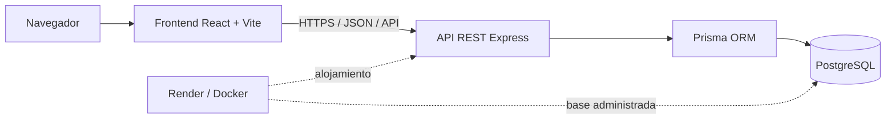

# EduRoom - Réplica académica independiente para proyecto de ingeniería inversa

EduRoom es una aplicación LMS full-stack desarrollada como resultado de un examen práctico de ingeniería inversa ética. Implementa flujos de profesor y estudiante, cursos, anuncios, tareas, entregas, comentarios, calificaciones y controles educativos de seguridad.

| Recurso | Enlace |
|---|---|
| Aplicación en Render | [https://eduroom-znb0.onrender.com](https://eduroom-znb0.onrender.com) |
| Repositorio GitHub | [https://github.com/juan-p0422/proyecto_ING-INV](https://github.com/juan-p0422/proyecto_ING-INV) |
| Índice documental | [`docs/00-indice.md`](docs/00-indice.md) |
| Reporte final | [`docs/17-reporte-final-integrado.md`](docs/17-reporte-final-integrado.md) |
| Auditoría de cumplimiento | [`docs/21-matriz-cumplimiento-rubrica.md`](docs/21-matriz-cumplimiento-rubrica.md) |

## Aviso ético

Google Classroom se utilizó únicamente como referencia externa no open source mediante un enfoque ético de **caja negra**. El análisis se limitó a información pública, interfaces visibles, flujos normales y acciones realizadas con cuentas controladas.

No se vulneró Google Classroom, no se evadió autenticación, no se explotaron vulnerabilidades, no se descompiló software y no se accedió a código, datos o infraestructura propietarios. EduRoom fue escrito de forma independiente y no incorpora logos, activos, textos comerciales, credenciales ni identidad visual de Google.

Las referencias a Google Classroom sirven exclusivamente para identificar el objeto académico observado. La réplica compara patrones funcionales generales de una plataforma LMS, no una implementación interna ni una equivalencia pixel a pixel.

## Descripción

El proyecto sigue esta secuencia:

1. Recolección de información pública y observación funcional.
2. Análisis dinámico no invasivo desde el navegador.
3. Reconstrucción conceptual de entidades, estados y relaciones.
4. Diseño e implementación independiente de EduRoom.
5. Aplicación de cifrado, checksum, ofuscación y diagnóstico antireversing educativo.
6. Validación mediante pruebas unitarias, API, seguridad defensiva y capturas visuales.
7. Preparación de documentación y demostración presencial.

## Funcionalidades

- Registro, login y consulta de la sesión autenticada.
- Contraseñas protegidas con bcrypt y sesiones JWT.
- Roles globales `TEACHER` y `STUDENT`.
- Membresía y rol específico dentro de cada curso.
- Creación, listado, consulta e ingreso a cursos mediante código.
- Listado de integrantes.
- Anuncios del profesor.
- Tareas con descripción y fecha de entrega.
- Entregas del estudiante.
- Calificación de 0 a 100 y retroalimentación.
- Comentarios generales o relacionados con una tarea.
- Modelo de adjuntos asociado al dominio.
- Estado público de integridad.
- Notas seguras cifradas mediante AES-256-GCM.
- Build opcional con ofuscación del JavaScript del frontend.
- Checksum SHA-256 de artefactos compilados.
- Diagnóstico antidebug educativo y no destructivo.

## Arquitectura



| Capa | Tecnologías | Responsabilidad |
|---|---|---|
| Frontend | React 19, TypeScript, Vite, React Router | Navegación, formularios, paneles y consumo de la API |
| Backend | Node.js 20+, Express, TypeScript, Zod | API REST, autenticación, autorización, validación y reglas de negocio |
| Persistencia | PostgreSQL, Prisma | Esquema, migraciones, relaciones y consultas parametrizadas |
| Seguridad | JWT, bcrypt, AES-256-GCM, SHA-256, Helmet | Sesiones, contraseñas, cifrado de campo, integridad y cabeceras |
| Build | npm, TypeScript, Vite, `javascript-obfuscator` | Compilación y build educativo opcional |
| Contenedores | Docker, Docker Compose | PostgreSQL y aplicación full-stack reproducible |
| Producción | Render Web Service y Render PostgreSQL | Deploy público, healthcheck y secretos administrados |

En producción, Express sirve la SPA compilada y la API bajo el mismo origen. En desarrollo, Vite y Express pueden ejecutarse por separado.

## Estructura del repositorio

```text
.
├── backend/
│   ├── prisma/                 Esquema, migraciones y seed
│   ├── src/                    API, middleware, rutas y seguridad
│   ├── tests/                  Pruebas del backend
│   └── Dockerfile              Imagen full-stack multietapa
├── frontend/
│   ├── src/                    Aplicación React
│   ├── scripts/                Ofuscación del build
│   └── tests/                  Pruebas del cliente/API
├── docs/                       Memoria técnica y presentación
├── evidence/                   Capturas y evidencia sanitizada
├── scripts/                    Checksum, integridad y utilidades
├── tests/                      Smoke, seguridad, Postman y Playwright
├── docker-compose.yml          Entorno local con PostgreSQL
├── render.yaml                 Blueprint de Render
├── integrity-manifest.json     Manifest SHA-256 de artefactos
├── .env.example                Plantilla para Docker Compose
└── package.json                Scripts de orquestación
```

## Requisitos

- Node.js 20 o superior.
- npm.
- PostgreSQL 16 o compatible para ejecución manual.
- Docker Desktop y Docker Compose para el camino recomendado con contenedores.
- Chrome o Chromium para las capturas Playwright.

## Instalación local

### Opción A: Docker Compose

Es el camino más corto porque crea PostgreSQL y la aplicación:

```bash
git clone https://github.com/juan-p0422/proyecto_ING-INV.git
cd proyecto_ING-INV
docker compose up --build -d
docker compose ps
docker compose exec backend npm run prisma:seed
```

Abrir [http://localhost:3000](http://localhost:3000). Comprobar la API:

```bash
curl http://localhost:3000/api/health
```

Para detener sin borrar el volumen:

```bash
docker compose down
```

`docker compose down -v` elimina también el volumen local de PostgreSQL. No usarlo si se desea conservar la base.

### Opción B: npm y PostgreSQL local

Clonar e instalar las tres capas de dependencias:

```bash
git clone https://github.com/juan-p0422/proyecto_ING-INV.git
cd proyecto_ING-INV
npm install
npm run install:all
```

El primer comando instala las herramientas de la raíz; `install:all` instala backend y frontend. También pueden ejecutarse por separado:

```bash
npm --prefix backend install
npm --prefix frontend install
```

Copiar las plantillas:

```bash
cp backend/.env.example backend/.env
cp frontend/.env.example frontend/.env
```

En PowerShell:

```powershell
Copy-Item backend/.env.example backend/.env
Copy-Item frontend/.env.example frontend/.env
```

Configurar `backend/.env` con una base PostgreSQL local y secretos nuevos. Después:

```bash
npm --prefix backend run db:generate
npm --prefix backend run prisma:migrate
npm --prefix backend run prisma:seed
```

## Variables de entorno

No se incluyen secretos reales. Las plantillas versionadas son:

- [`.env.example`](.env.example), para Docker Compose;
- [`backend/.env.example`](backend/.env.example), para la API;
- [`frontend/.env.example`](frontend/.env.example), para Vite.

| Variable | Componente | Propósito |
|---|---|---|
| `POSTGRES_DB` | Compose | Nombre de la base local |
| `POSTGRES_USER` | Compose | Usuario local de PostgreSQL |
| `POSTGRES_PASSWORD` | Compose | Contraseña local; reemplazar el placeholder |
| `DATABASE_URL` | Backend | Cadena de conexión de Prisma |
| `JWT_SECRET` | Backend | Firma JWT; usar un secreto aleatorio de al menos 32 caracteres |
| `JWT_EXPIRES_IN` | Backend | Duración de la sesión; valor predeterminado `8h` |
| `APP_ENCRYPTION_KEY` | Backend | Material secreto para derivar la clave AES-256-GCM |
| `PORT` | Backend | Puerto HTTP; predeterminado `3000` |
| `NODE_ENV` | Backend | `development`, `test` o `production` |
| `CORS_ORIGIN` | Backend | Orígenes permitidos; `self` en Render |
| `STRICT_INTEGRITY` | Backend | Si es `true`, bloquea el arranque ante integridad no verificada |
| `INTEGRITY_MANIFEST_PATH` | Backend | Ruta opcional al manifest |
| `VITE_API_URL` | Frontend | Base de la API incorporada al build |

Generar material de cifrado para desarrollo:

```bash
node -e "console.log(require('crypto').randomBytes(32).toString('hex'))"
```

No reutilizar `JWT_SECRET` como `APP_ENCRYPTION_KEY`. No confirmar archivos `.env` ni mostrar sus valores en capturas.

Verificación de archivos de ambiente rastreados:

```bash
git ls-files | grep -E '(^|/)\.env($|\.)'
```

PowerShell:

```powershell
git ls-files | Select-String '(^|/)\.env($|\.)'
```

La salida esperada contiene únicamente los tres archivos `.env.example`.

## Ejecución local

Con PostgreSQL y migraciones preparados, iniciar en dos terminales:

```bash
# Terminal 1: API en http://localhost:3000
npm run dev:backend

# Terminal 2: Vite en http://localhost:5173
npm run dev:frontend
```

`frontend/.env` debe apuntar a `http://localhost:3000/api`.

Para ejecutar la compilación full-stack directamente:

```bash
npm run build
npm --prefix backend start
```

Con `NODE_ENV=production`, el backend sirve `frontend/dist`.

## Build e integridad

Build normal:

```bash
npm run build
```

Build con ofuscación del JavaScript:

```bash
npm run build:obfuscated
```

Release educativa coherente:

```bash
npm run release:educational
```

La release educativa:

1. compila backend;
2. compila y ofusca el JavaScript del frontend;
3. genera `integrity-manifest.json`;
4. verifica SHA-256.

También pueden ejecutarse las etapas:

```bash
node scripts/generate-checksum.js
node scripts/verify-integrity.js
```

El manifest debe generarse después de la última transformación. `npm run build` produce bytes distintos del build ofuscado y puede hacer que un manifest anterior falle correctamente.

El verificador CLI cubre 22 artefactos del manifest actual. El verificador de arranque y `/api/security/integrity` resumen 19 archivos JavaScript del backend. En `render.yaml`, `STRICT_INTEGRITY` permanece en `false`.

## Prisma: migraciones y seed

Generar el cliente:

```bash
npm --prefix backend run db:generate
```

Crear o aplicar una migración en desarrollo:

```bash
npm --prefix backend run prisma:migrate
```

Aplicar migraciones existentes sin crear nuevas:

```bash
npm --prefix backend run db:deploy
```

Cargar datos demo:

```bash
npm --prefix backend run prisma:seed
```

En Docker:

```bash
docker compose exec backend npm run prisma:seed
```

El seed usa `upsert`, por lo que puede repetirse para restaurar el escenario conocido.

## Credenciales demo locales

Estas credenciales están implementadas en [`backend/prisma/seed.ts`](backend/prisma/seed.ts) y solo existen después de ejecutar el seed:

| Rol | Correo | Contraseña |
|---|---|---|
| Profesor | `teacher@eduroom.local` | `Teacher123!` |
| Estudiante | `student@eduroom.local` | `Student123!` |

El seed también crea el curso `Diseño de experiencias educativas`, código `AULA2026`, un anuncio, una tarea, una entrega y un comentario.

No cargar estas credenciales conocidas en Render ni en otro ambiente público. En el deploy público se debe registrar una cuenta temporal con datos sintéticos o usar cuentas controladas creadas específicamente para la demostración.

## Despliegue en Render

[`render.yaml`](render.yaml) declara:

- PostgreSQL administrado;
- un servicio web Node;
- build de backend y frontend;
- migraciones antes del arranque;
- healthcheck en `/api/health`;
- generación de `JWT_SECRET` y `APP_ENCRYPTION_KEY`;
- CORS de mismo origen.

Procedimiento:

1. Confirmar el commit que se desea desplegar.
2. En Render, seleccionar **New > Blueprint**.
3. Conectar el repositorio.
4. Aplicar `render.yaml`.
5. Confirmar que los secretos se administran desde Render y no desde el repositorio.
6. Esperar el deploy y comprobar:

```bash
curl https://eduroom-znb0.onrender.com/api/health
curl https://eduroom-znb0.onrender.com/api/security/integrity
```

El build declarado actualmente ejecuta `npm run build`, no el build ofuscado. Para acreditar ofuscación en producción se debe actualizar la canalización, redesplegar y conservar evidencia. El procedimiento completo está en [`docs/10-despliegue-render.md`](docs/10-despliegue-render.md).

## Endpoints principales

Salvo los endpoints marcados como públicos, se requiere:

```http
Authorization: Bearer <token>
```

| Área | Método | Ruta | Acceso |
|---|---|---|---|
| Salud | GET | `/api/health` | Público |
| Autenticación | POST | `/api/auth/register` | Público |
| Autenticación | POST | `/api/auth/login` | Público |
| Autenticación | GET | `/api/auth/me` | Autenticado |
| Cursos | GET | `/api/courses` | Autenticado |
| Cursos | POST | `/api/courses` | Profesor |
| Cursos | GET | `/api/courses/:id` | Integrante |
| Cursos | POST | `/api/courses/join` | Autenticado |
| Cursos | GET | `/api/courses/:id/members` | Integrante |
| Anuncios | GET | `/api/courses/:courseId/announcements` | Integrante |
| Anuncios | POST | `/api/courses/:courseId/announcements` | Profesor propietario |
| Tareas | GET | `/api/courses/:courseId/assignments` | Integrante |
| Tareas | POST | `/api/courses/:courseId/assignments` | Profesor propietario |
| Tareas | GET | `/api/assignments/:id` | Integrante |
| Entregas | POST | `/api/assignments/:id/submit` | Estudiante inscrito |
| Entregas | PATCH | `/api/submissions/:id/grade` | Profesor propietario |
| Comentarios | GET | `/api/courses/:courseId/comments` | Integrante |
| Comentarios | POST | `/api/courses/:courseId/comments` | Integrante |
| Seguridad | GET | `/api/security/integrity` | Público; resumen sin rutas ni hashes |
| Seguridad | POST | `/api/security/secure-notes` | Autenticado |
| Seguridad | GET | `/api/security/secure-notes` | Propietario autenticado |

`GET /api/courses/:courseId/comments` acepta `assignmentId` como query opcional. Las calificaciones se validan entre 0 y 100.

## Pruebas

### Unitarias

```bash
npm test
```

La última auditoría documentada obtuvo 9 pruebas de backend y 2 de frontend aprobadas.

### API en Render

```bash
node tests/render-api-smoke-test.js
```

El smoke test ejecuta 26 solicitudes secuenciales con cuentas `example.com` únicas. No imprime tokens, contraseñas ni códigos. Crea datos sintéticos persistentes; usarlo de forma puntual, nunca en bucle.

Para un entorno local:

```powershell
$env:EDUROOM_BASE_URL = 'http://localhost:3000'
node tests/render-api-smoke-test.js
```

También puede importarse [`tests/eduroom-render.postman_collection.json`](tests/eduroom-render.postman_collection.json). Resultados: [`docs/14-pruebas-api-render.md`](docs/14-pruebas-api-render.md).

### Seguridad defensiva

```bash
node tests/render-security-check.js
```

Comprueba acceso sin token, token inválido, payload vacío, exposición de `passwordHash`, CORS, integridad y restricciones de rol. No realiza fuerza bruta, carga, fuzzing agresivo ni pruebas contra Google Classroom. Resultados: [`docs/15-analisis-vulnerabilidades.md`](docs/15-analisis-vulnerabilidades.md).

### UI de EduRoom

```bash
npm run capture:ui
```

Playwright captura exclusivamente EduRoom en escritorio, tableta y móvil. No automatiza Google Classroom. Las imágenes se guardan en [`evidence/ui/eduroom/`](evidence/ui/eduroom/) y el reporte está en [`docs/18-capturas-eduroom-render.md`](docs/18-capturas-eduroom-render.md).

### Checksum

```bash
npm run integrity:verify
```

La prueba de fallo debe ejecutarse solo sobre una copia temporal. No regenerar el manifest inmediatamente después de una discrepancia sin investigar su causa.

## Documentación

| Documento | Contenido |
|---|---|
| [00 - Índice](docs/00-indice.md) | Navegación y correspondencia con la consigna |
| [01 - Marco teórico](docs/01-marco-teorico.md) | Fundamentos, términos y ética |
| [02 - Análisis de Google Classroom](docs/02-analisis-google-classroom.md) | Información pública y observación funcional |
| [03 - Herramientas](docs/03-herramientas-utilizadas.md) | Instrumentos y trazabilidad |
| [04 - Análisis dinámico](docs/04-analisis-dinamico.md) | Network, Application, Performance y Memory |
| [05 - Reconstrucción](docs/05-reconstruccion-estructuras.md) | Modelo conceptual de datos |
| [06 - Diseño de la réplica](docs/06-diseno-replica.md) | Arquitectura y flujos |
| [07 - Seguridad y antireversing](docs/07-seguridad-antireversing.md) | Integridad y diagnóstico educativo |
| [08 - Checksum](docs/08-checksum.md) | SHA-256 y manifests |
| [09 - Cifrado y ofuscación](docs/09-cifrado-ofuscacion.md) | AES-GCM y build ofuscado |
| [10 - Render](docs/10-despliegue-render.md) | Docker y despliegue |
| [11 - Conclusiones](docs/11-conclusiones.md) | Resultados y limitaciones |
| [12 - Guion](docs/12-guion-presentacion.md) | Exposición presencial de 8–12 minutos |
| [13 - Evidencias](docs/13-evidencias.md) | Checklist y privacidad |
| [14 - Pruebas API](docs/14-pruebas-api-render.md) | Contratos y resultados en Render |
| [15 - Vulnerabilidades](docs/15-analisis-vulnerabilidades.md) | OWASP y pruebas defensivas |
| [16 - Comparativo UI](docs/16-comparativo-ui.md) | Correspondencia funcional y visual |
| [17 - Reporte integrado](docs/17-reporte-final-integrado.md) | Memoria académica completa |
| [18 - Capturas](docs/18-capturas-eduroom-render.md) | Evidencia Playwright y responsive |
| [19 - Diapositivas](docs/19-presentacion-diapositivas.md) | Estructura de 15 diapositivas |
| [20 - Validación de seguridad](docs/20-validacion-seguridad-producto.md) | Checksum, cifrado, ofuscación y antireversing |
| [21 - Matriz de rúbrica](docs/21-matriz-cumplimiento-rubrica.md) | Auditoría final y acciones pendientes |
| [Comparativo listo para PDF](docs/pdf/comparativo-ui-print.md) | Maquetación imprimible del comparativo |

## Evidencias

[`evidence/`](evidence/) organiza:

```text
evidence/
├── api/
├── ui/
│   ├── google-classroom/
│   └── eduroom/
├── security/
├── render/
├── github/
├── database/
└── presentation/
```

La guía de nombres, privacidad, hashes y trazabilidad está en [`evidence/README.md`](evidence/README.md). Las capturas de Google Classroom deben ser propias, manuales, autorizadas y anonimizadas. Ningún script del repositorio abre o captura ese servicio.

## Presentación presencial

- [Guion listo para decir](docs/12-guion-presentacion.md).
- [Estructura de 15 diapositivas](docs/19-presentacion-diapositivas.md).
- [Checklist de evidencias](docs/13-evidencias.md).
- [Reporte final](docs/17-reporte-final-integrado.md).

El guion incluye dos perfiles de navegador, demo profesor-estudiante, endpoint de salud, integridad, repositorio y planes B para Render lento o ausencia de Internet.

## Limitaciones

- El análisis externo no revela ni pretende reproducir la implementación interna de Google Classroom.
- Faltan capturas manuales finales de Classroom, Network, Application y Performance/Memory.
- El registro público permite solicitar el rol `TEACHER`; una versión productiva debe usar invitación o aprobación.
- El JWT se almacena en `localStorage`; se recomienda evaluar cookies `HttpOnly`, `SameSite`, CSRF y revocación.
- El modelo incluye adjuntos, pero no existe carga binaria ni almacenamiento de archivos.
- No se implementan recuperación de cuenta, notificaciones, rúbricas, auditoría completa ni limpieza de datos QA.
- Las pruebas contra Render crean datos sintéticos persistentes.
- `STRICT_INTEGRITY=false` prioriza disponibilidad; el endpoint runtime verifica el backend, no todo el frontend.
- El pipeline actual de Render compila sin ofuscación.
- SHA-256 no firma el manifest y la ofuscación no vuelve secreto el código del navegador.
- AES-GCM protege únicamente `SecureNote.encryptedPayload`; no todo el sistema.
- No existe rotación de `APP_ENCRYPTION_KEY` ni KMS/HSM.
- El login presenta un overflow horizontal documentado en el viewport de 768 × 1024.
- El healthcheck no publica commit o versión, por lo que debe correlacionarse manualmente con el despliegue.

## Licencia y uso académico

Este repositorio se preparó para evaluación, demostración y aprendizaje académico. No se encontró un archivo `LICENSE` en la versión auditada; por tanto, la publicación del código no concede automáticamente permisos de copia, modificación o redistribución más allá de los permitidos por la legislación aplicable.

Si el proyecto se publica formalmente como open source, el mantenedor debe añadir una licencia explícita —por ejemplo MIT, Apache-2.0 o la que corresponda— después de revisar dependencias, obligaciones y política institucional.

EduRoom no está afiliado con Google. Google Classroom y las marcas mencionadas pertenecen a sus respectivos titulares.
