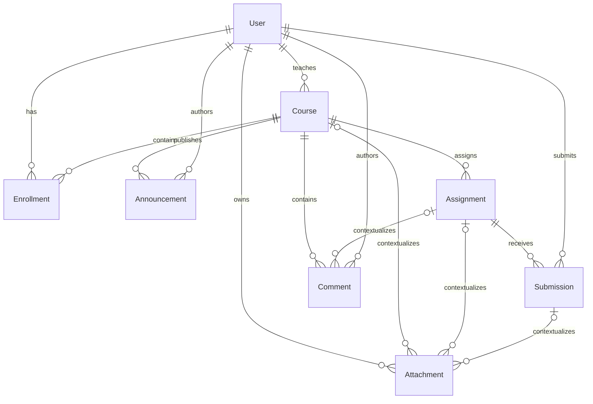

# 05. Reconstrucción de estructuras

## Del comportamiento al dominio

La reconstrucción se limita a un modelo conceptual suficiente para EduRoom. Las entidades se derivan de responsabilidades visibles en interfaces y flujos de usuario, contrastadas con documentación pública y principios comunes de diseño de LMS. No se inspeccionó código fuente, bases de datos ni interfaces privadas de Google Classroom; por ello este esquema no pretende describir su implementación interna.

El razonamiento aplicado fue: una acción observable sugiere una responsabilidad del dominio, pero no demuestra una tabla concreta. EduRoom convierte esas responsabilidades en un diseño propio y verificable.

| Señal funcional observada | Concepto reconstruido | Decisión de EduRoom |
|---|---|---|
| Una persona inicia sesión y actúa como docente o estudiante | Identidad y autorización | `User` con rol global y contraseña derivada con bcrypt |
| Un docente crea un espacio y otras personas entran con código | Curso, propietario y membresía | `Course.teacherId`, `Course.code` y `Enrollment` |
| El tablón presenta comunicaciones asociadas al curso | Publicación académica | `Announcement` con curso y autor |
| Una actividad tiene instrucciones y vencimiento | Trabajo asignado | `Assignment` con `dueDate` opcional |
| Un alumno entrega contenido y después recibe evaluación | Ciclo de entrega | `Submission` con estado, calificación y retroalimentación |
| La conversación puede pertenecer al curso o a una actividad | Comentario contextual | `Comment.assignmentId` opcional |
| Los recursos pueden acompañar distintos objetos | Metadatos de archivo | `Attachment` con relaciones opcionales |

## Modelo de datos implementado

### Identidad, cursos y membresías

- `User`: `id`, `name`, `email`, `passwordHash`, `role` y `createdAt`. El correo es único y `passwordHash` nunca forma parte de las respuestas de la API.
- `Course`: `id`, `title`, `description`, `code`, `teacherId` y `createdAt`. `teacherId` expresa propiedad inequívoca; `code` es único. `color` es un atributo adicional propio de presentación de EduRoom.
- `Enrollment`: `id`, `userId`, `courseId`, `roleInCourse` y `createdAt`. La combinación usuario–curso es única.

`Enrollment` resuelve la relación muchos-a-muchos. El rol global determina capacidades generales, mientras `roleInCourse` representa la función dentro de un curso. Al crear un curso, EduRoom escribe de forma transaccional lógica al propietario y su inscripción docente.

### Comunicación y trabajo académico

- `Announcement`: pertenece a un curso y conserva su autor, título, contenido y fecha.
- `Assignment`: pertenece a un curso y contiene título, descripción, fecha límite opcional y fecha de creación.
- `Submission`: une una tarea con un estudiante. La restricción única impide más de una entrega activa por estudiante y tarea; una nueva entrega actualiza la existente. `status` pasa de `SUBMITTED` a `GRADED` al calificar.
- `Comment`: pertenece siempre a un curso y, opcionalmente, a una tarea del mismo curso. También conserva autor y fecha.
- `Attachment`: registra propietario y metadatos (`fileName`, `fileUrl`, `mimeType`). Puede contextualizarse en curso, tarea o entrega. El modelo no implica que el backend ya transfiera archivos: solo define la persistencia necesaria para una futura integración de almacenamiento autorizada.

## Relaciones principales

El diagrama representa el diseño de Prisma de EduRoom. Las relaciones opcionales de `Attachment` permiten reutilizar metadatos, pero las reglas de negocio de una futura API de archivos deberán exigir al menos un contexto válido y comprobar que todas las referencias pertenezcan al mismo curso.

## Estados y reglas de autorización

| Regla | Implementación |
|---|---|
| Correo y código únicos | Restricciones únicas en PostgreSQL |
| Acceso a un curso | JWT válido más una inscripción del usuario |
| Creación de curso | Rol global `TEACHER` |
| Administración del curso | Coincidencia entre usuario autenticado y `Course.teacherId` |
| Anuncios y tareas | Lectura para integrantes; creación solo para el propietario |
| Entrega | Rol global e inscripción local `STUDENT` en el curso de la tarea |
| Privacidad de entregas | El estudiante solo recibe su entrega; el docente propietario puede consultar todas |
| Calificación | Solo el docente propietario; nota entre 0 y 100 |
| Comentario de tarea | La tarea debe pertenecer al mismo curso del comentario |
| Exposición de identidad | Selecciones Prisma explícitas omiten `passwordHash` |

> **Espacio de evidencia EV-05-01:** diagrama ER exportado desde el esquema Prisma y salida de `prisma validate`.

> **Espacio de evidencia EV-05-02:** pruebas autorizadas donde un estudiante no pueda crear tareas, ver entregas ajenas ni calificar.

## Alcance y limitaciones de la reconstrucción

El modelo conserva únicamente el mínimo útil para reproducir capacidades generales. No afirma equivalencia de nombres, cardinalidades, estados o mecanismos con Google Classroom. No se modelan notificaciones, historial de versiones, rúbricas, almacenamiento binario, auditoría detallada ni integraciones externas. Esas extensiones requieren nueva evidencia funcional, análisis de privacidad y reglas explícitas antes de implementarse.
