# Comparativo visual de UIs: Google Classroom observado vs EduRoom

**Referencia pública observada vs réplica académica independiente** 
**Fecha:** 16-08-2026 (`America/Mexico_City`) 
**EduRoom:** <https://eduroom-znb0.onrender.com> 
**Repositorio:** <https://github.com/juan-p0422/proyecto_ING-INV>

## Propósito

Comparar composición, navegación, jerarquía, densidad, flujos, responsividad aproximada y correspondencia funcional. La referencia manual puede conservar su resolución original; EduRoom demuestra adicionalmente tres viewports propios. No se busca equivalencia pixel a pixel.

## Nota de autorización de evidencias

> Las capturas de Google Classroom corresponden a evidencia manual obtenida desde cuentas personales/controladas por el alumno. El alumno autorizó su inclusión sin anonimización adicional. Se usan exclusivamente con fines académicos para demostrar flujos, estructura y comportamiento observable.

Las capturas de Classroom se incluyen sin censura ni modificación y se identifican como **referencia manual de escritorio, resolución original 1919 × 1079**. No se automatizó Google Classroom. EduRoom no incorpora logos, recursos visuales o textos propietarios de Google.

## Escala

| Nivel | Interpretación |
|---|---|
| Alta | Coinciden objetivo, jerarquía y flujo principal |
| Media | Coincide el objetivo con cambios relevantes |
| Baja | Correspondencia parcial o estado distinto |
| No aplicable | Elemento exclusivo sin equivalente requerido |

## 1. Login / Inicio — Baja

| Google Classroom: captura funcional más cercana | EduRoom: acceso público |
|---|---|
|  | 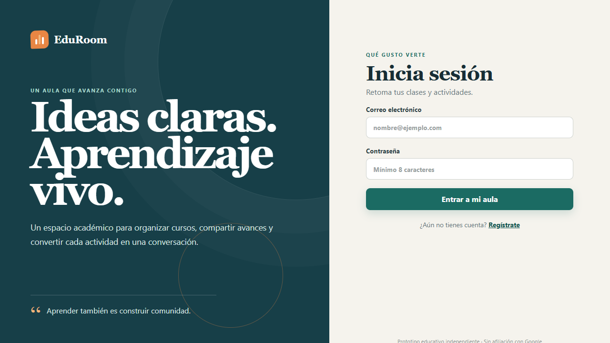 |

**Qué comparar:** entrada, orientación y acceso a cursos. 
**Similitudes:** puntos iniciales del entorno educativo. 
**Diferencias deliberadas:** Classroom está autenticado; EduRoom muestra login/registro con identidad propia. 
**Decisión:** captura funcional equivalente; no se inventa un login de Classroom inexistente.

## 2. Dashboard de cursos — Alta

| Google Classroom: referencia manual | EduRoom: escritorio |
|---|---|
| 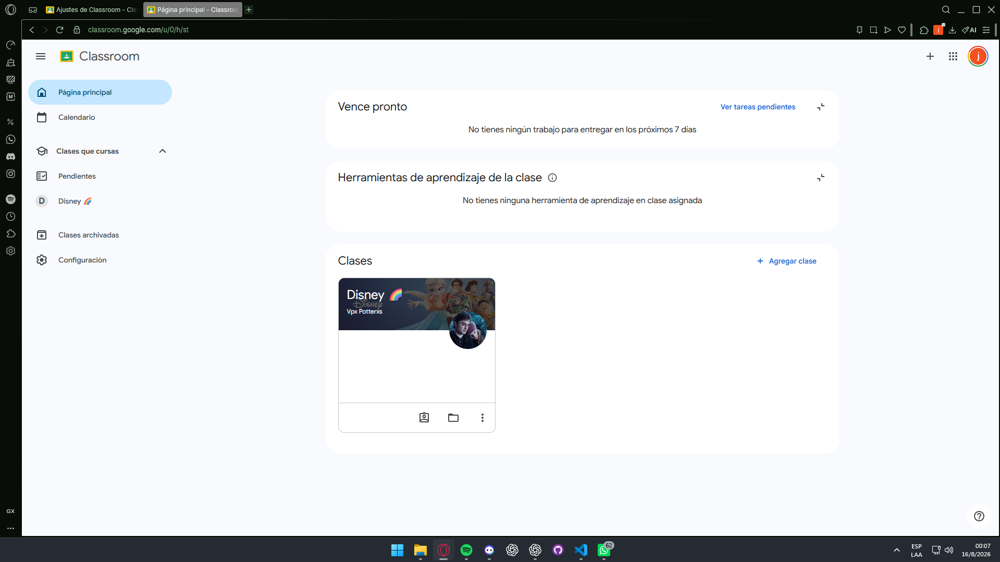 |  |

**Qué comparar:** colección, navegación y acciones. 
**Similitudes:** curso como unidad central y acceso por tarjeta. 
**Diferencias deliberadas:** layout, tarjetas, paleta, copy e integridad propios.

## 3. Creación de clase — Media

| Google Classroom: creación | EduRoom: acción desde dashboard |
|---|---|
| 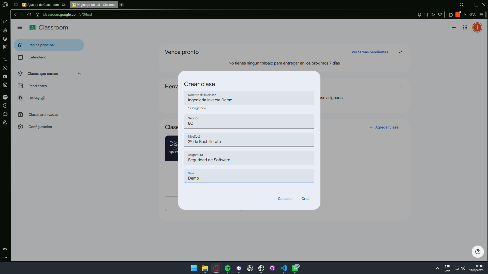 |  |

**Qué comparar:** descubrimiento de acción y datos mínimos. 
**Similitudes:** creación situada en el contexto docente principal. 
**Diferencias deliberadas:** el modal de EduRoom no aparece en la evidencia; modelo y campos propios. 
**Decisión:** se reutiliza la captura más cercana de EduRoom.

## 4. Tablón del curso — Alta

| Google Classroom: referencia manual | EduRoom: escritorio |
|---|---|
| 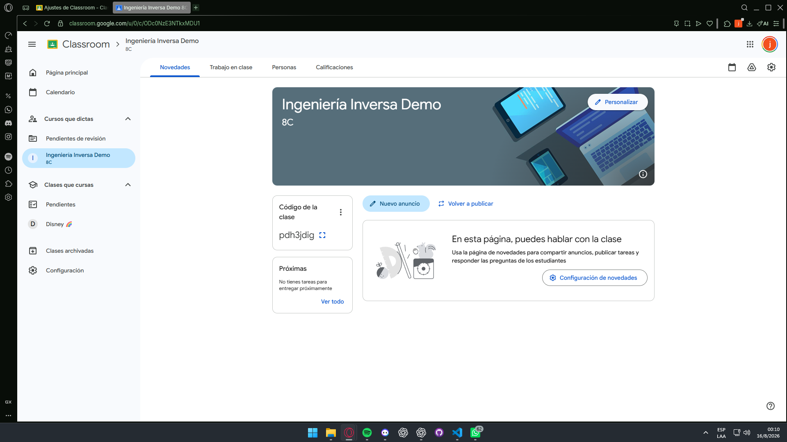 | 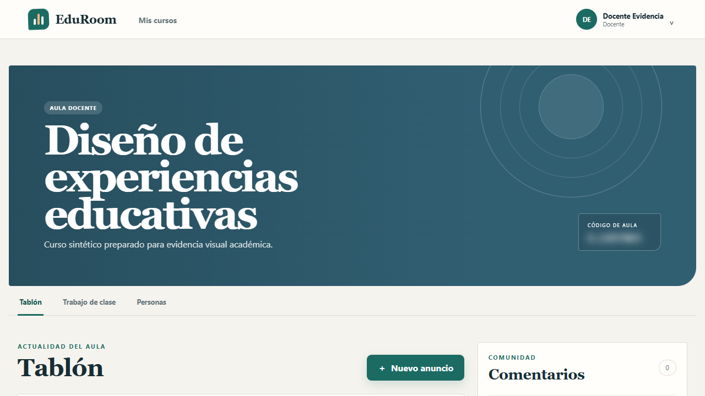 |

**Qué comparar:** contexto, pestañas, publicaciones y acciones. 
**Similitudes:** navegación contextual y comunicación del curso. 
**Diferencias deliberadas:** encabezado, componentes y textos originales.

## 5. Trabajo de clase — Media

| Google Classroom: editor de tarea | EduRoom: listado de actividades |
|---|---|
| 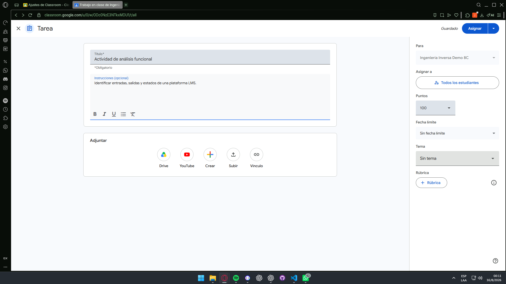 | 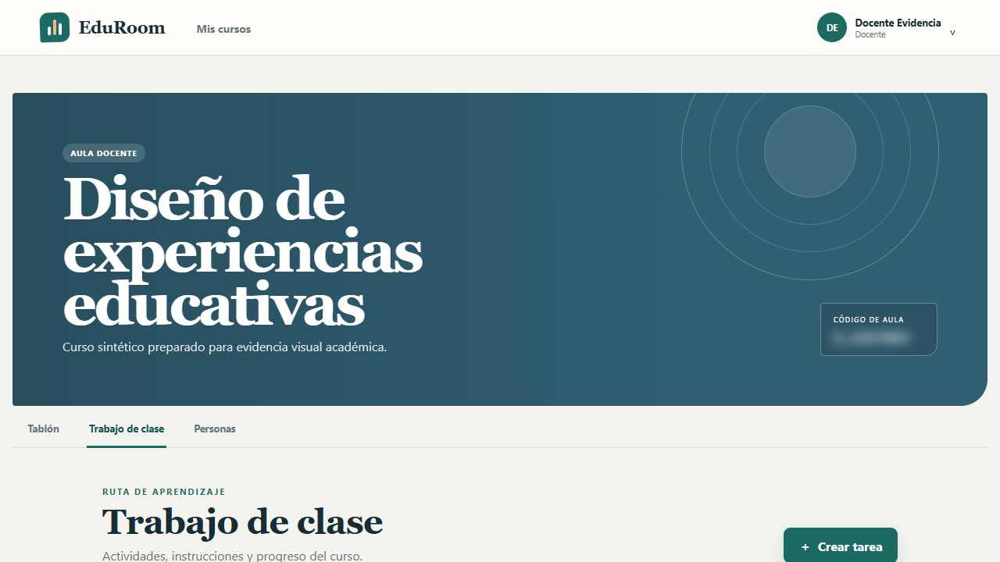 |

**Qué comparar:** gestión docente, jerarquía y tareas. 
**Similitudes:** actividades centralizadas dentro del curso. 
**Diferencias deliberadas:** editor detallado frente a listado reducido. 
**Decisión:** captura funcional equivalente, no mismo subestado.

## 6. Detalle de tarea — Alta

| Google Classroom: referencia manual | EduRoom: escritorio |
|---|---|
| 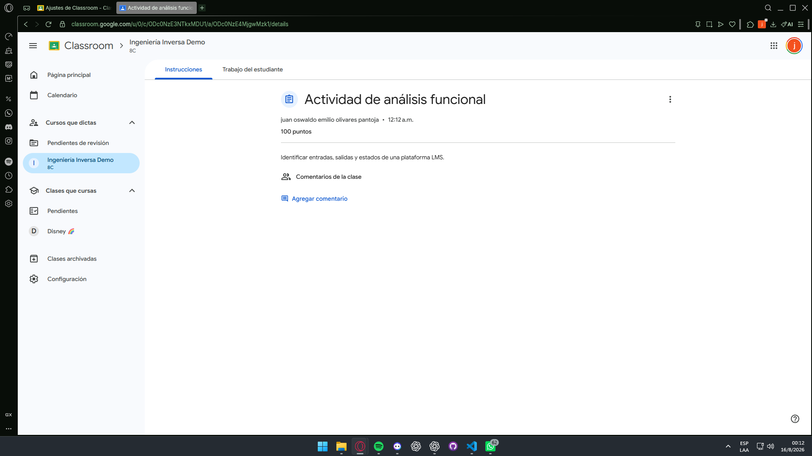 | 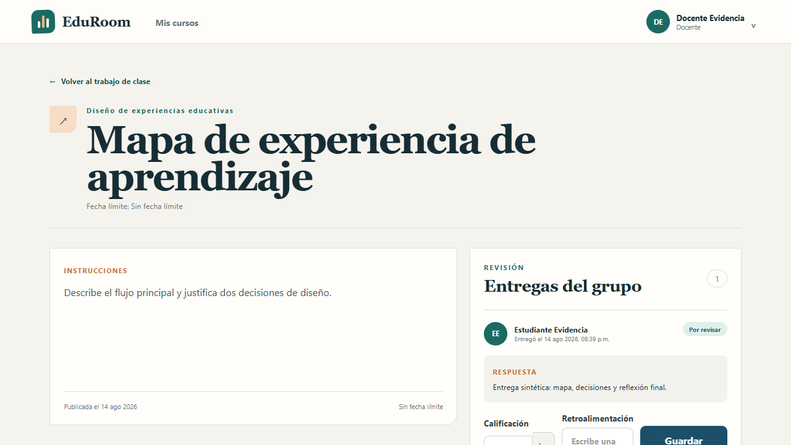 |

**Qué comparar:** título, instrucciones, metadatos, comentarios y estado. 
**Similitudes:** actividad como centro del flujo. 
**Diferencias deliberadas:** paneles, textos y alcance propios.

## 7. Entrega de tarea — Alta

| Google Classroom: referencia manual | EduRoom: escritorio |
|---|---|
| 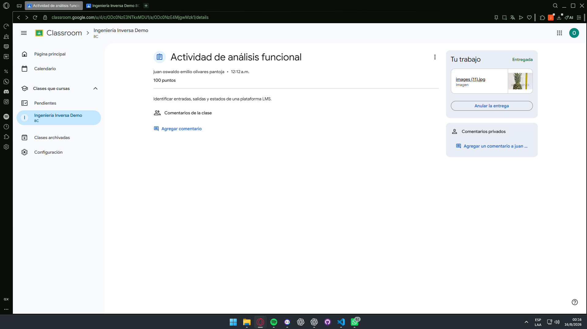 | 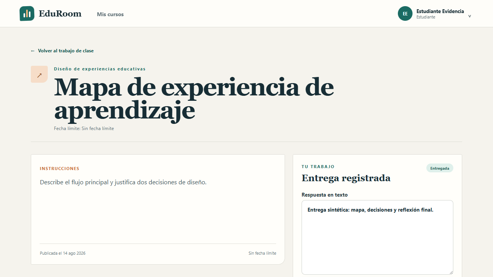 |

**Qué comparar:** trabajo, estado y acción de entrega. 
**Similitudes:** cambio de estado vinculado a la tarea. 
**Diferencias deliberadas:** EduRoom usa respuesta textual y no replica integraciones.

## 8. Personas / miembros — Alta

| Google Classroom: referencia manual | EduRoom: escritorio |
|---|---|
| 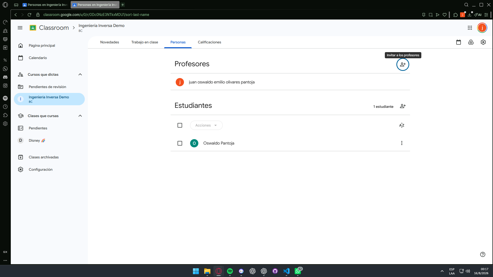 | 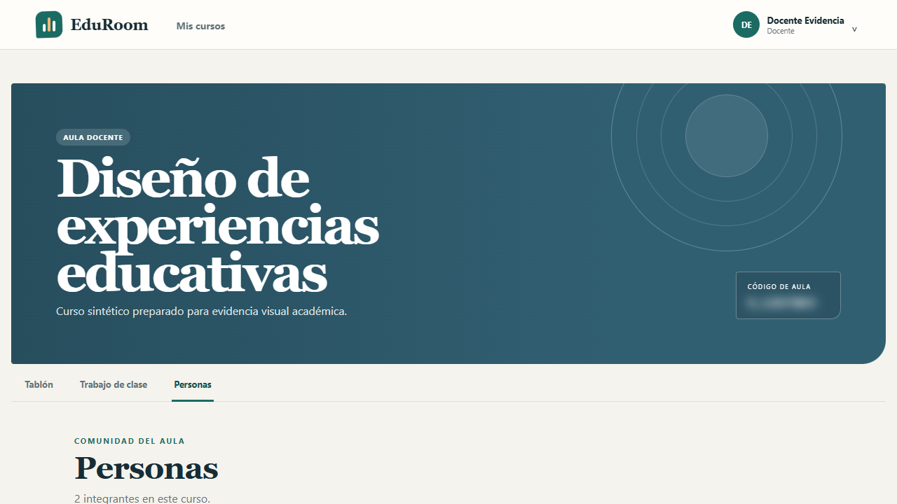 |

**Qué comparar:** roles, agrupación y densidad. 
**Similitudes:** secciones diferenciadas para profesores y estudiantes. 
**Diferencias deliberadas:** tarjetas y avatares tipográficos propios.

## 9. Calificaciones — Media

| Google Classroom: libro agregado | EduRoom: resultado individual |
|---|---|
| 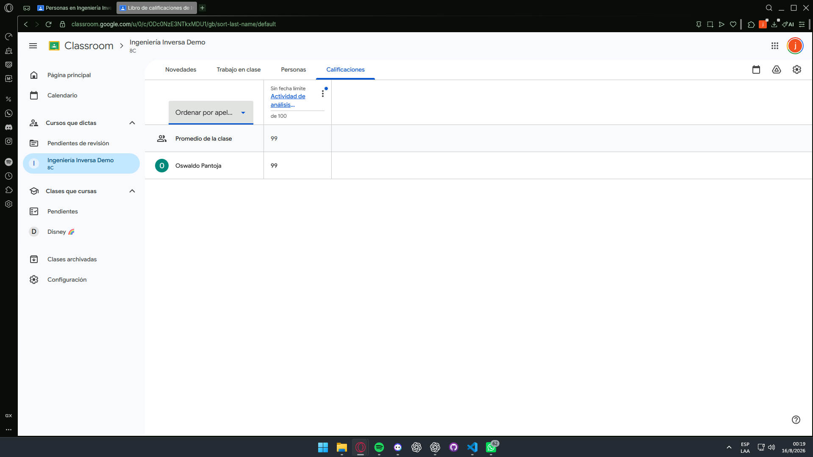 |  |

**Qué comparar:** nota, escala, estado y vínculo con actividad. 
**Similitudes:** evaluación como cierre del trabajo. 
**Diferencias deliberadas:** vista agregada frente a nota/feedback individual.

## 10. Seguridad / integridad — No aplicable

| Google Classroom | EduRoom: elemento propio |
|---|---|
| No se busca equivalente. | 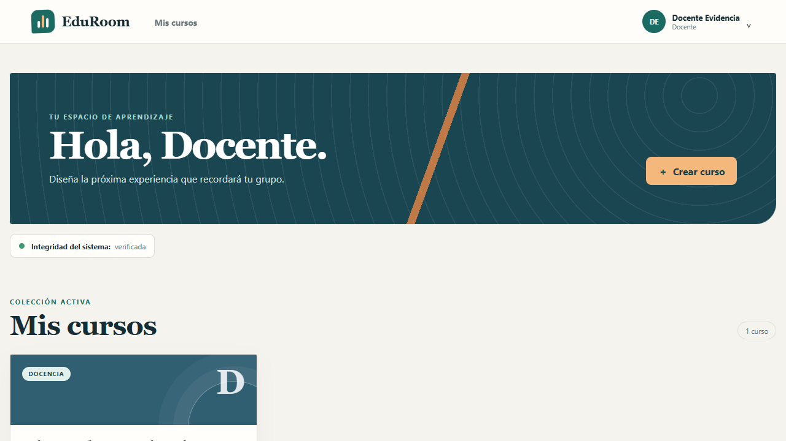 |

Panel académico propio que muestra un resumen no sensible del checksum. No se utiliza para atribuir funciones o debilidades a Classroom.

## Evidencia dinámica complementaria

| Network | Application |
|---|---|
| 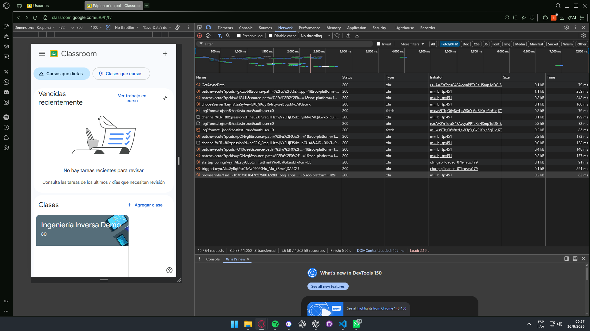 | **[EVIDENCIA EN REVISIÓN]** GC-DYN-03 se conserva sin modificación, pero no se incrusta en el PDF de entrega mientras las cookies visibles puedan ser reutilizables. |

| Performance | Memory |
|---|---|
| 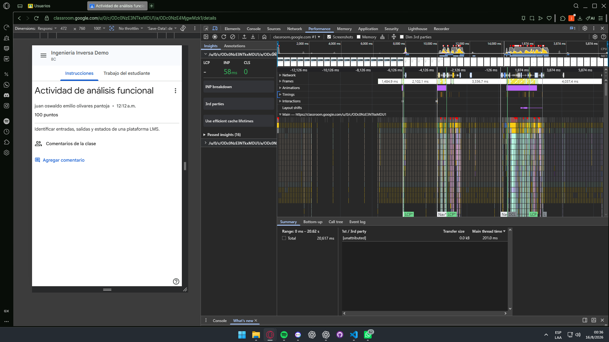 | 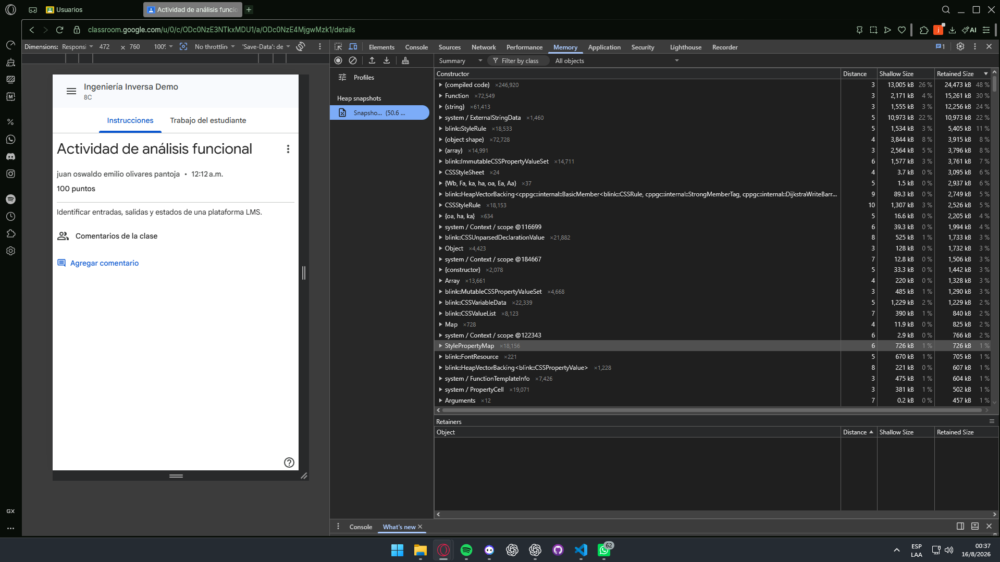 |

Capturas complementarias disponibles: `GC-DYN-02-network-status-codes.png` y `GC-DYN-04-service-workers-cache.png`.

## Comparativo responsivo de EduRoom

Classroom se usa como referencia manual observada en resolución original. La respuesta multiplataforma se acredita sobre EduRoom, que sí puede capturarse automáticamente en Render.

| Flujo | 1280 × 720 | 768 × 1024 | 390 × 844 |
|---|---|---|---|
| Login | [Escritorio](../evidence/ui/eduroom/01-login--desktop-1280x720.png) | [Tableta](../evidence/ui/eduroom/01-login--tablet-768x1024.png) | [Móvil](../evidence/ui/eduroom/01-login--mobile-390x844.png) |
| Dashboard | [Escritorio](../evidence/ui/eduroom/02-dashboard-cursos--desktop-1280x720.png) | [Tableta](../evidence/ui/eduroom/02-dashboard-cursos--tablet-768x1024.png) | [Móvil](../evidence/ui/eduroom/02-dashboard-cursos--mobile-390x844.png) |
| Tablón | [Escritorio](../evidence/ui/eduroom/03-curso-tablon--desktop-1280x720.png) | [Tableta](../evidence/ui/eduroom/03-curso-tablon--tablet-768x1024.png) | [Móvil](../evidence/ui/eduroom/03-curso-tablon--mobile-390x844.png) |
| Trabajo | [Escritorio](../evidence/ui/eduroom/04-trabajo-clase--desktop-1280x720.png) | [Tableta](../evidence/ui/eduroom/04-trabajo-clase--tablet-768x1024.png) | [Móvil](../evidence/ui/eduroom/04-trabajo-clase--mobile-390x844.png) |
| Personas | [Escritorio](../evidence/ui/eduroom/05-personas--desktop-1280x720.png) | [Tableta](../evidence/ui/eduroom/05-personas--tablet-768x1024.png) | [Móvil](../evidence/ui/eduroom/05-personas--mobile-390x844.png) |
| Detalle | [Escritorio](../evidence/ui/eduroom/06-detalle-tarea--desktop-1280x720.png) | [Tableta](../evidence/ui/eduroom/06-detalle-tarea--tablet-768x1024.png) | [Móvil](../evidence/ui/eduroom/06-detalle-tarea--mobile-390x844.png) |
| Entrega | [Escritorio](../evidence/ui/eduroom/07-entrega--desktop-1280x720.png) | [Tableta](../evidence/ui/eduroom/07-entrega--tablet-768x1024.png) | [Móvil](../evidence/ui/eduroom/07-entrega--mobile-390x844.png) |
| Calificación | [Escritorio](../evidence/ui/eduroom/08-calificacion-retroalimentacion--desktop-1280x720.png) | [Tableta](../evidence/ui/eduroom/08-calificacion-retroalimentacion--tablet-768x1024.png) | [Móvil](../evidence/ui/eduroom/08-calificacion-retroalimentacion--mobile-390x844.png) |
| Integridad | [Escritorio](../evidence/ui/eduroom/09-integridad--desktop-1280x720.png) | [Tableta](../evidence/ui/eduroom/09-integridad--tablet-768x1024.png) | [Móvil](../evidence/ui/eduroom/09-integridad--mobile-390x844.png) |

## Resumen de calidad

| Dimensión | Evaluación |
|---|---|
| Estructura y navegación | Alta en los flujos principales |
| Respuesta multiplataforma | Alta en EduRoom; referencia Classroom de escritorio |
| Identidad y contenido | Independiente |
| Equivalencia estricta | No pretendida |
| Limitaciones | Inicio, creación y trabajo usan capturas funcionales cercanas o subestados distintos |

## Conclusión

Las evidencias respaldan correspondencia funcional alta en dashboard, tablón, detalle, entrega y personas; media en creación, trabajo y calificaciones; y baja en inicio por diferencia de estado. EduRoom demuestra además una respuesta consistente en tres viewports.

La réplica conserva patrones generales de un LMS sin ser una copia visual exacta y sin incorporar marcas, assets o textos propietarios de Google. El comparativo se considera documentalmente cerrado con las capturas manuales autorizadas disponibles y las limitaciones declaradas.
