<style>
body { font-family: Arial, Helvetica, sans-serif; line-height: 1.45; color: #172033; }
h1, h2, h3 { color: #173b67; }
table { width: 100%; border-collapse: collapse; margin: 1em 0; }
th, td { border: 1px solid #cbd5e1; padding: 0.45em; vertical-align: top; }
figure { break-inside: avoid; margin: 1.2em auto; text-align: center; }
figure img { max-width: 94%; max-height: 19cm; object-fit: contain; }
figcaption { margin-top: 0.45em; font-size: 0.9em; color: #475569; }
.figure-grid { display: grid; grid-template-columns: 1fr 1fr; gap: 0.8cm; align-items: start; }
.figure-grid figure img { max-height: 10.5cm; }
.page-break { break-after: page; page-break-after: always; }
.cover { text-align: center; margin-top: 10%; }
.notice { border-left: 5px solid #0e6b66; padding: 0.7em 1em; background: #f0fdfa; }
@media print { a { color: inherit; text-decoration: none; } }
</style>

<div class="cover">

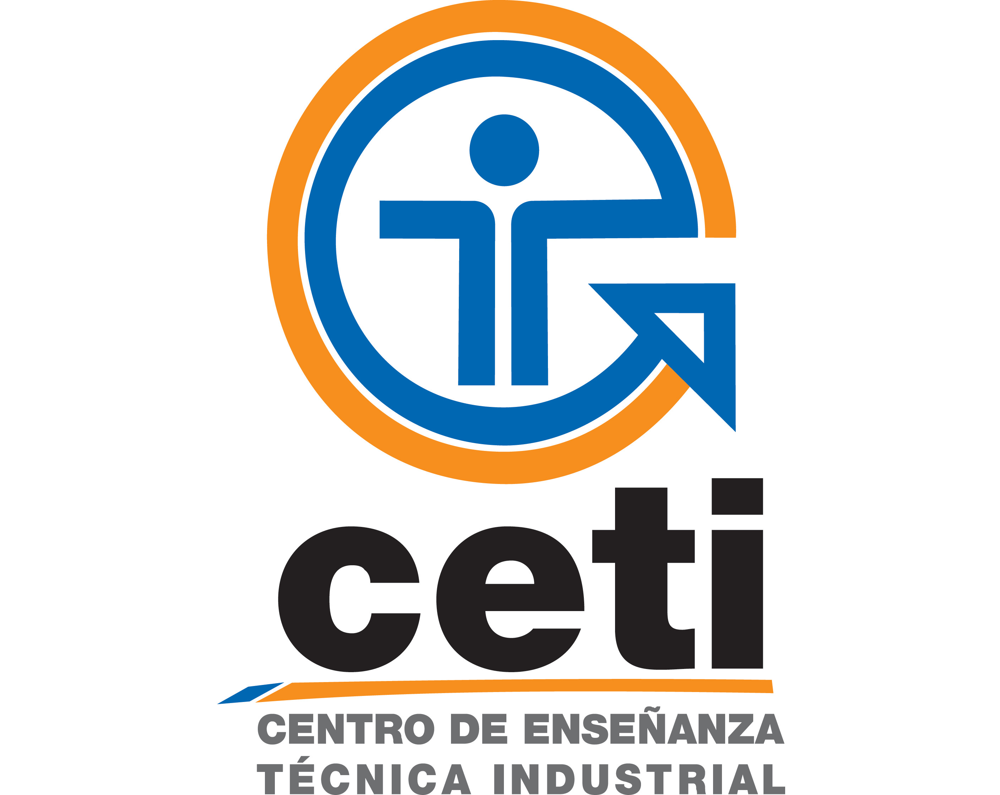{ width=180px }

# EduRoom

## Reporte final de práctica

**Materia:** Ingeniería Inversa  
**Aplicación objetivo:** Google Classroom  
**Tipo de entrega:** Reporte de práctica  
**Repositorio:** <https://github.com/juan-p0422/proyecto_ING-INV>  
**Deploy:** <https://eduroom-znb0.onrender.com>

| Campo académico | Valor |
|---|---|
| Alumno | **Juan Oswaldo Emilio Olivares Pantoja** |
| Número de registro | **23110022** |
| Grupo | **8C** |
| Fecha | **16 de agosto de 2026** |
| Nombre final del PDF | `II_GLOBAL_23110022_8C.pdf` |

</div>

> **Identificación de entrega:** alumno Juan Oswaldo Emilio Olivares Pantoja, registro 23110022, grupo 8C. El archivo final se entrega como `II_GLOBAL_23110022_8C.pdf`.

> **Declaración de independencia:** EduRoom es una implementación académica independiente. No es un producto de Google, no está afiliado con Google y no incorpora código, logos, assets, textos comerciales o identidad visual propietaria de Google.

<div class="page-break"></div>

# Nota de autorización y protección de secretos

> Las capturas de Google Classroom y otras plataformas corresponden a cuentas personales/controladas por el alumno. El alumno autorizó su inclusión sin anonimización adicional. Se usan exclusivamente como evidencia académica de flujos, pruebas y despliegue.

La presencia de nombres del alumno, avatares propios, URL, identificadores, códigos de clases controladas o una resolución como 1919 x 1079 no invalida las imágenes. Los originales se incorporan sin censura, recorte, modificación o cambio de resolución. No se exige que Classroom coincida con los viewports usados para EduRoom y no se realiza comparación pixel a pixel.

Esta autorización no comprende secretos reutilizables. No se insertan contraseñas, JWT completos, cookies de sesión, encabezados `Authorization`, claves API, tokens privados, valores completos de variables sensibles o cadenas de conexión. Las carpetas técnicas sin PNG se declaran pendientes; no se inventan imágenes.

> **Reevaluación de seguridad del 16-08-2026:** `GC-DYN-03-application-storage.png` muestra valores de cookies de sesión y queda **Requiere revisión**. El original se conserva conforme a la autorización, pero esta fuente y el PDF ya exportado no deben entregarse o proyectarse hasta invalidar las sesiones asociadas o producir una edición segura autorizada que omita esa figura.

# Índice

1. Introducción
2. Objetivos
3. Marco teórico
4. Aplicación analizada
5. Ingeniería inversa y metodología ética
6. Análisis dinámico y memoria
7. Análisis de vulnerabilidades
8. Reconstrucción de estructuras
9. Réplica EduRoom
10. Cifrado y ofuscación
11. Checksum e integridad
12. Antireversing y limitaciones del cliente web
13. Despliegue
14. Pruebas y endpoints
15. Evidencias y cumplimiento
16. Conclusiones
17. Integración documental
18. Exportación a PDF
19. Anexo visual

# Lista de figuras y evidencias

| Figuras | Categoría | Qué demuestran | Estado |
|---|---|---|---|
| 1-9 | Referencia observada | Flujos manuales de Google Classroom | 9 disponibles, resolución original |
| 10-15 | Evidencia dinámica | Network, Application, Performance y Memory de Classroom | 6 disponibles; métricas manuales no inventadas |
| 16-42 | Réplica - serie principal | 9 flujos de EduRoom en escritorio, tableta y móvil | 27 disponibles |
| 43-69 | Réplica - serie complementaria | Segunda serie visual de los mismos 9 flujos | 27 disponibles |
| SEC-07 | Prueba técnica documental | Build ofuscado reproducible | TXT disponible; no existe PNG |
| API-01..06 | Prueba técnica | API, health, integridad y Postman | **[PENDIENTE DE CAPTURA MANUAL]** |
| SEC-01..06 | Prueba técnica | Integridad, autorización y cifrado | **[PENDIENTE DE CAPTURA MANUAL]** |
| RND-01..05 | Despliegue | Servicio, deploy, variables ocultas y logs | **[PENDIENTE DE CAPTURA MANUAL]** |
| DB-01..04 | Base de datos | PostgreSQL, migraciones, cifrado y datos de prueba | **[PENDIENTE DE CAPTURA MANUAL]** |
| GH-01..04 | Repositorio | Inicio, commits, documentación y despliegue | **[PENDIENTE DE CAPTURA MANUAL]** |

El inventario físico completo se mantiene en [27. Evidencias técnicas finales](27-evidencias-tecnicas-finales.md).

<div class="page-break"></div>

# 1. Introducción

La ingeniería inversa de software permite transformar comportamiento observable en descripciones de funciones, estados, estructuras y decisiones de diseño. En un contexto académico legítimo requiere autorización, minimización de datos, respeto a la propiedad intelectual y exclusión de técnicas destinadas a evadir controles.

Este proyecto analiza Google Classroom como aplicación no open source mediante información pública, observación manual con cuentas controladas y análisis dinámico no invasivo desde DevTools. A partir de los flujos observados se construyó EduRoom, una aplicación web propia con roles, cursos, tareas, entregas, comentarios, calificaciones y controles defensivos.

No se afirma acceso al código, base de datos o infraestructura interna de Google. Tampoco se afirma que Google Classroom haya sido vulnerado o copiado. La correspondencia evaluada es funcional y estructural, no visual exacta.

# 2. Objetivos

## 2.1 Objetivo general

Demostrar un procedimiento completo de ingeniería inversa ética sobre una aplicación propietaria observada externamente, reconstruir un modelo conceptual, implementar una réplica académica independiente y validar sus funciones y controles mediante evidencia reproducible.

## 2.2 Objetivos específicos

- Identificar roles, flujos, entradas, salidas y estados observables.
- Documentar análisis dinámico, Performance y Memory sin automatizar Classroom.
- Reconstruir estructuras de datos como modelo propio de EduRoom.
- Implementar frontend, backend, persistencia y despliegue.
- Aplicar JWT, roles, bcrypt, validación, AES-GCM, ofuscación y checksum.
- Evaluar riesgos con una perspectiva OWASP defensiva.
- Probar API, UI, integridad y autorización con datos controlados.
- Reconocer límites: cliente observable, manifest no firmado y evidencia manual pendiente.

# 3. Marco teórico

| Concepto | Definición aplicada | Límite académico |
|---|---|---|
| Ingeniería inversa | Inferir requisitos y estructuras desde comportamiento externo | No autoriza acceso interno o evasión |
| Análisis estático | Revisión del código y configuración propios de EduRoom | No se aplicó a código propietario de Google |
| Análisis dinámico | Observación durante ejecución normal | Se limitó a cuentas controladas y bajo volumen |
| OSINT | Uso de documentación y fuentes públicas | Las tecnologías internas no se confirman por inferencia |
| Checksum | Hash para detectar diferencias respecto de un manifest | No autentica autor ni sustituye firma digital |
| Cifrado | Protección reversible con clave | Solo se aplica a datos seleccionados de EduRoom |
| Ofuscación | Transformación que dificulta lectura | No vuelve invisible ni irreversible el frontend |
| Antireversing | Capas de dificultad, diagnóstico e integridad | No proporciona protección absoluta |

Desarrollo ampliado: [01. Marco teórico](01-marco-teorico.md), [07. Seguridad](07-seguridad-antireversing.md), [08. Checksum](08-checksum.md) y [09. Cifrado/ofuscación](09-cifrado-ofuscacion.md).

# 4. Aplicación analizada: Google Classroom

Google Classroom se tomó como referencia pública para observar patrones generales de una plataforma educativa: acceso, dashboard, curso, tablón, trabajo de clase, detalle de tarea, entrega, personas y calificaciones. Las entradas visibles incluyen credenciales, códigos controlados, textos, archivos y notas; las salidas incluyen estados, listados, publicaciones, entregas y retroalimentación.

Las nueve capturas UI y seis capturas de DevTools provienen de sesiones manuales autorizadas. Su resolución original se conserva y su presencia no demuestra frameworks, esquemas o topologías internas.

Véanse [02. Análisis de Classroom](02-analisis-google-classroom.md), [16. Comparativo UI](16-comparativo-ui.md), [24. Guía de capturas](24-guia-capturas-classroom.md) y las figuras 1-15.

# 5. Ingeniería inversa y metodología ética

La metodología siguió esta secuencia:

```text
fuentes públicas -> observación de caja negra -> DevTools manual
-> reconstrucción conceptual -> diseño propio -> implementación
-> controles defensivos -> pruebas -> evidencia
```

Se distinguieron tres niveles:

1. **Observado:** comportamiento visible desde una cuenta controlada.
2. **Inferido:** hipótesis razonables, nunca presentadas como certeza interna.
3. **Implementado:** decisiones verificables en el repositorio de EduRoom.

No se automatizó Classroom, no hubo scraping, bypass, explotación, fuerza bruta, carga, decompilación o acceso a datos de terceros. EduRoom usa nombre, interfaz, código y recursos propios.

# 6. Análisis dinámico, Performance y Memory

| Área | Evidencia disponible | Interpretación permitida |
|---|---|---|
| Network | GC-DYN-01/02 | Solicitudes y recursos visibles de la sesión |
| Application | GC-DYN-03/04 | Categorías de almacenamiento, cache y service workers |
| Performance | GC-DYN-05 | Traza manual existente; valores pendientes de transcripción validada |
| Memory | GC-DYN-06 | Heap snapshot manual existente; no se publica un volcado sensible |
| EduRoom | JSON y PNG en `evidence/performance/eduroom/` | Muestra reproducible y de bajo volumen |

La medición de EduRoom registró los valores disponibles en el JSON de evidencia, incluyendo tiempos del navegador, recursos, transferencia cuando estuvo disponible y heap JavaScript cuando la API lo permitió. No se extrapola una muestra puntual a capacidad global ni se inventan métricas de Classroom.

Protocolo y resultados: [04. Análisis dinámico](04-analisis-dinamico.md) y [25. Performance/Memory](25-medicion-performance-memory.md).

# 7. Análisis de vulnerabilidades

La revisión OWASP se aplicó al código y despliegue propios de EduRoom, no a Google Classroom.

| ID | Riesgo | Severidad | Estado y tratamiento |
|---|---|---:|---|
| V-01 | Registro público permite solicitar rol docente | Alta | Abierto; alta por invitación o aprobación |
| V-02 | JWT en `localStorage` | Alta | Abierto; cookie `HttpOnly`, `Secure`, `SameSite` y CSP |
| V-03 | Sin revocación o refresh rotatorio | Media | Abierto; sesión corta y revocable |
| V-04 | Código de curso sin expiración | Media | Abierto; rotación y aprobación |
| V-05 | Manifest SHA-256 no firmado | Media | Parcial; firma o attestation de CI/CD |
| V-06 | Deploy público observado con integridad no bloqueante | Media operativa | Candidato local estricto; falta acreditar redespliegue |
| V-07 | Clave AES única sin rotación | Media | Abierto; KMS, versión y recifrado |
| V-08 | Auditoría estructurada limitada | Media | Abierto; logs sanitizados y alertas |
| V-09 | Riesgo futuro de dependencias | Variable | Mitigado en la auditoría puntual; revisar continuamente |
| V-10 | Adjuntos futuros pueden introducir SSRF o malware | Media futura | No aplicable mientras no exista carga binaria |

Las 14 comprobaciones defensivas documentadas fueron aprobadas, pero prueban únicamente los escenarios ejecutados. Véase [15. Análisis de vulnerabilidades](15-analisis-vulnerabilidades.md).

# 8. Reconstrucción de estructuras

Las entidades siguientes pertenecen a EduRoom y no se atribuyen al esquema interno de Google.

| Estructura | Campos o relaciones esenciales | Función |
|---|---|---|
| User | identidad, correo, `passwordHash`, rol | Autenticación y rol global |
| Course | título, código, docente, color | Espacio académico |
| Enrollment | usuario, curso, rol contextual | Membresía N a N |
| Announcement | curso, autor, contenido | Comunicación del tablón |
| Assignment | curso, instrucciones, fecha | Actividad académica |
| Submission | tarea, estudiante, contenido, estado, nota, feedback | Entrega y evaluación |
| Comment | curso, tarea opcional, autor | Conversación autorizada |
| Attachment | propietario y contexto opcional | Metadatos; carga binaria no implementada |
| SecureNote | propietario y payload cifrado | Demostración AES-GCM |

```text
User 1 - N Course (docente)
User N - N Course (Enrollment)
Course 1 - N Assignment
Assignment 1 - N Submission
Course/Assignment 1 - N Comment
User 1 - N SecureNote
```

Detalle: [05. Reconstrucción](05-reconstruccion-estructuras.md) y `backend/prisma/schema.prisma`.

# 9. Réplica EduRoom

EduRoom separa responsabilidades en tres capas:

```text
React + TypeScript + Vite
          -> API REST /api
Express + Zod + Prisma
          -> PostgreSQL
```

El frontend representa navegación y estado visual. El backend valida JWT, rol, membresía, propiedad y entrada. PostgreSQL persiste las entidades. Los flujos de profesor permiten crear curso, anuncio, tarea y calificación; los de estudiante permiten incorporarse, consultar y entregar. Los integrantes pueden comentar según autorización.

Las figuras 16-69 demuestran los nueve flujos UI en escritorio, tableta y móvil. Las dos series se conservan como evidencia, pero no se contabilizan como 18 flujos diferentes.

# 10. Cifrado y ofuscación

| Mecanismo | Implementación | Propiedad | Límite |
|---|---|---|---|
| bcrypt | Contraseñas con coste adaptativo | Resistencia de credenciales almacenadas | No recupera ni cifra contraseñas |
| AES-256-GCM | `SecureNote.encryptedPayload` con IV y tag | Confidencialidad y autenticidad del dato | No cifra toda la base; depende de la clave |
| Ofuscación | `javascript-obfuscator` sobre bundle propio | Dificultad de lectura | No impide ingeniería inversa |
| HTTPS | Transporte hacia navegador | Confidencialidad en tránsito | El cliente autorizado recibe el código ejecutable |

El comando `npm run build:obfuscated` constituye una demostración reproducible. `render:build` incorpora la estrategia candidata, pero no se atribuye al despliegue público hasta correlacionar el commit y los logs. SEC-07 es evidencia documental equivalente, no una captura PNG.

# 11. Checksum e integridad

El manifest de integridad registra scope, ruta, SHA-256 y tamaño de artefactos compilados. El servidor verifica antes de abrir el puerto y clasifica archivos modificados, ausentes o inesperados.

- Producción observada: `verified`, 19 archivos y cero discrepancias, en modo no bloqueante.
- Candidato local: 22 artefactos backend/frontend y `STRICT_INTEGRITY=true`.
- Demostración controlada: `tests/integrity-demo.js` modifica solo una copia temporal y detecta la discrepancia.

SHA-256 detecta cambios respecto de un manifest confiable. No impide que un actor sustituya también manifest o verificador y no reemplaza una firma digital, attestation o control de despliegue. Véanse [28. Validación estricta](28-validacion-strict-integrity.md) y [08. Checksum](08-checksum.md).

# 12. Antireversing y limitaciones del cliente web

HTML, CSS y JavaScript deben descargarse al navegador. DevTools puede inspeccionar DOM, estilos, bundles y solicitudes. Esta observabilidad no se considera ausencia de control: EduRoom presupone un cliente observable y mantiene secretos y decisiones críticas en el servidor.

La ofuscación eleva el esfuerzo de lectura; el checksum detecta diferencias; el diagnóstico antidebug emite advertencias no destructivas. Ninguna medida vuelve invisible el frontend o garantiza imposibilidad de análisis. El control se clasifica **Cumple con limitación técnica documentada** conforme a [29. Limitaciones del cliente web](29-limitaciones-proteccion-cliente-web.md).

# 13. Despliegue

EduRoom se despliega en Render con PostgreSQL, migraciones Prisma, healthcheck y configuración Blueprint. El repositorio contiene Dockerfile, Compose y `render.yaml` para reproducibilidad.

| Elemento | Evidencia verificable | Reserva |
|---|---|---|
| Aplicación pública | <https://eduroom-znb0.onrender.com> | Puede presentar cold start |
| Health | `/api/health` respondió HTTP 200 en la validación | No expone commit o versión |
| Integridad | `/api/security/integrity` respondió `verified` | Observación pública anterior: 19 archivos, no bloqueante |
| Pipeline candidato | `npm run render:build` y `STRICT_INTEGRITY=true` | Requiere redespliegue y log correlacionado |
| Base de datos | PostgreSQL y migraciones configuradas | Capturas DB pendientes |

La validación end-to-end se documenta en [22. Validación final de Render](22-validacion-final-render.md).

# 14. Pruebas y endpoints

## 14.1 Endpoints probados

| Área | Método y ruta | Acceso esperado |
|---|---|---|
| Salud | `GET /api/health` | Público |
| Autenticación | `POST /api/auth/register`, `POST /api/auth/login`, `GET /api/auth/me` | Público/autenticado |
| Cursos | `GET/POST /api/courses`, `POST /api/courses/join` | Autenticado/docente |
| Curso | `GET /api/courses/:id`, `GET /api/courses/:id/members` | Integrante |
| Anuncios | `GET/POST /api/courses/:courseId/announcements` | Integrante/docente propietario |
| Tareas | `GET/POST /api/courses/:courseId/assignments`, `GET /api/assignments/:id` | Integrante/docente propietario |
| Entregas | `POST /api/assignments/:id/submit`, `PATCH /api/submissions/:id/grade` | Estudiante/docente propietario |
| Comentarios | `GET/POST /api/courses/:courseId/comments` | Integrante |
| Seguridad | `GET /api/security/integrity` | Resumen público |
| Notas seguras | `POST/GET /api/security/secure-notes` | Propietario autenticado |

## 14.2 Resultados resumidos

| Suite | Resultado documentado | Interpretación |
|---|---:|---|
| Vitest backend | 10 aprobadas | Checksum, cifrado, SPA e integridad |
| Vitest frontend | 2 aprobadas | Cliente API |
| API Render | 26/26 solicitudes | Flujo end-to-end de bajo volumen |
| Seguridad Render | 14/14 comprobaciones | Casos defensivos seleccionados |
| UI Render | 27 capturas principales | 9 flujos x 3 viewports |
| Revisión responsive | 1 advertencia | Overflow de 32 px en login de tableta |

Los resultados no garantizan ausencia de defectos. Véanse [14. Pruebas API](14-pruebas-api-render.md), [18. Capturas de EduRoom](18-capturas-eduroom-render.md) y [27. Inventario](27-evidencias-tecnicas-finales.md).

# 15. Evidencias y cumplimiento

## 15.1 Requisitos frente a evidencia

| Requisito | Evidencia principal | Estado |
|---|---|---|
| Introducción, objetivos y marco | Secciones 1-3 y documentos 01/17 | Cumple |
| Aplicación no open source | Classroom observado externamente | Cumple |
| Ingeniería inversa ética | Metodología, límites y guía 24 | Cumple |
| Análisis dinámico | 6 capturas manuales, protocolo y métricas visibles transcritas | Cumple documentalmente; GC-DYN-03 requiere revisión de seguridad |
| Uso de memoria | Captura manual de heap y muestra reproducible de EduRoom | Cumple documentalmente; muestra de cliente, no servidor ni benchmark |
| Vulnerabilidades | OWASP y 14 controles | Cumple |
| Estructuras | Modelo Prisma propio | Cumple |
| Réplica | EduRoom full-stack y deploy | Cumple |
| Cifrado/ofuscación | AES-GCM y build reproducible | Cumple |
| Checksum | Inicio, manifest y demo temporal | Cumple |
| Antireversing | Ofuscación, integridad y diagnóstico | Cumple con límites documentados |
| Comparativo UI | 9 pares y tres viewports de EduRoom | Cumple; resolución original aceptada |
| Evidencias técnicas | UI disponible; 25 capturas técnicas faltantes | Parcial justificado por ausencia física; GC-DYN-03 requiere revisión |
| Presentación | Fuente de 16 diapositivas | Parcial justificado hasta PDF, ensayo y ejecución |

## 15.2 Evidencia visual resumida

| Categoría | Existente | Uso en este reporte |
|---|---:|---|
| Classroom UI | 9 PNG | Figuras 1-9 |
| Classroom dinámica | 6 PNG | Figuras 10-15 |
| EduRoom UI principal | 27 PNG | Figuras 16-42 |
| EduRoom UI complementaria | 27 PNG | Figuras 43-69 |
| API | 0 PNG | Pendiente, no insertada |
| Seguridad | 0 PNG + 1 TXT | SEC-07 referenciada |
| Render | 0 PNG | Pendiente, no insertada |
| Base de datos | 0 PNG | Pendiente, no insertada |
| GitHub | 0 PNG | Pendiente, no insertada |

El resultado oficial es **29 Cumple, 3 Cumple documentalmente, 2 Parcial justificado y 0 Falta**. El comparativo UI y las capturas autorizadas de Classroom no se penalizan por resolución, nombres visibles o ausencia de censura; GC-DYN-03 se separa únicamente porque las cookies visibles pueden constituir tokens privados reutilizables. Véanse [21. Matriz](21-matriz-cumplimiento-rubrica.md), [23. Cierre de brechas](23-cierre-brechas-finales.md) y [32. Veredicto final](32-veredicto-final-entrega.md).

# 16. Conclusiones

EduRoom demuestra un ciclo completo de observación ética, análisis dinámico, reconstrucción conceptual, implementación, protección, prueba y documentación. Classroom se trató como una referencia propietaria de caja negra; no se vulneró, automatizó o copió.

La réplica implementa los flujos esenciales con arquitectura y código propios. JWT, roles, bcrypt, validación, AES-GCM, checksum y ofuscación se presentan según su propósito y límites. La seguridad no depende de ocultar el frontend y no se promete protección absoluta.

Las evidencias disponibles respaldan los flujos manuales de Classroom, el comportamiento dinámico observado y la interfaz responsive de EduRoom. Las ausencias técnicas se mantienen explícitas y no se sustituyen por afirmaciones o imágenes inventadas.

El reporte contiene los datos académicos de portada y queda listo para su entrega en Word y PDF. El cierre global al 100 % todavía requiere transcripción manual de métricas, capturas técnicas faltantes, redespliegue correlacionado, ensayo y constancia de presentación.

# 17. Integración documental

| Documento | Integración en este reporte |
|---|---|
| [21. Matriz de cumplimiento](21-matriz-cumplimiento-rubrica.md) | Conteo 29/5/0 y criterio por requisito |
| [22. Validación final Render](22-validacion-final-render.md) | Salud, integridad y flujo productivo observado |
| [23. Cierre de brechas](23-cierre-brechas-finales.md) | Acciones manuales y estados esperados |
| [24. Guía de capturas Classroom](24-guia-capturas-classroom.md) | Captura manual, autorización y secretos |
| [25. Performance/Memory](25-medicion-performance-memory.md) | Protocolo Classroom y muestra EduRoom |
| [26. Comparativo UI imprimible](26-comparativo-ui-print.md) | Pares funcionales y responsive |
| [27. Evidencias técnicas](27-evidencias-tecnicas-finales.md) | Inventario físico y 25 capturas pendientes |
| [28. Integridad estricta](28-validacion-strict-integrity.md) | Producción no bloqueante y demo local estricta |
| [29. Limitación del cliente](29-limitaciones-proteccion-cliente-web.md) | Cliente observable y control en servidor |
| [30. Presentación final](30-presentacion-final-print.md) | Fuente Marp de 16 diapositivas |

# 18. Instrucciones de exportación

## 18.1 Verificar portada

1. Confirmar el alumno: Juan Oswaldo Emilio Olivares Pantoja.
2. Confirmar el número de registro: 23110022.
3. Conservar el nombre exacto: `II_GLOBAL_23110022_8C.pdf`.

## 18.2 Ruta recomendada HTML a PDF

Desde la raíz del repositorio, si Pandoc está disponible:

```bash
pandoc docs/31-reporte-final-pdf-ready.md --standalone --toc --resource-path=. -o evidence/final-pdf/II_GLOBAL_23110022_8C.html
```

Abrir el HTML en Chrome o Edge, seleccionar **Imprimir -> Guardar como PDF**, tamaño A4, escala 100 %, gráficos de fondo habilitados y encabezados/pies del navegador desactivados. Guardar como:

```text
evidence/final-pdf/II_GLOBAL_23110022_8C.pdf
```

## 18.3 Checklist de aceptación

- [x] Portada sin marcadores académicos pendientes.
- [x] Nombre del PDF con el número de registro real.
- [x] Índice, tablas y enlaces legibles.
- [x] 69 figuras renderizadas sin deformación.
- [x] Pies de figura visibles y asociados con su imagen.
- [x] Ningún secreto reutilizable visible.
- [x] PDF abierto y revisado página por página.
- [x] SHA-256 calculado sobre el PDF aprobado.
- [x] Ruta y hash registrados en `docs/13-evidencias.md`.

<div class="page-break"></div>

# 19. Anexo visual de evidencias existentes

## 19.1 Google Classroom - referencia observada

<div class="figure-grid">
<figure><figcaption><strong>Figura 1.</strong> Inicio autenticado de Classroom. Demuestra orientación inicial. Clasificación: referencia observada manual.</figcaption></figure>
<figure><figcaption><strong>Figura 2.</strong> Dashboard de clases. Demuestra colección y acceso a cursos. Clasificación: referencia observada manual.</figcaption></figure>
<figure><figcaption><strong>Figura 3.</strong> Creación de clase. Demuestra el flujo docente visible. Clasificación: referencia observada manual.</figcaption></figure>
<figure><figcaption><strong>Figura 4.</strong> Tablón del curso. Demuestra contexto, navegación y publicaciones. Clasificación: referencia observada manual.</figcaption></figure>
<figure><figcaption><strong>Figura 5.</strong> Trabajo de clase. Demuestra gestión visible de actividades. Clasificación: referencia observada manual.</figcaption></figure>
<figure><figcaption><strong>Figura 6.</strong> Detalle de tarea. Demuestra instrucciones y estado. Clasificación: referencia observada manual.</figcaption></figure>
<figure><figcaption><strong>Figura 7.</strong> Entrega de tarea. Demuestra acción y estado de envío. Clasificación: referencia observada manual.</figcaption></figure>
<figure><figcaption><strong>Figura 8.</strong> Personas. Demuestra agrupación de profesores y estudiantes. Clasificación: referencia observada manual.</figcaption></figure>
<figure><figcaption><strong>Figura 9.</strong> Calificaciones. Demuestra lectura agregada de evaluación. Clasificación: referencia observada manual.</figcaption></figure>
</div>

## 19.2 Google Classroom - evidencia dinámica

<div class="figure-grid">
<figure><figcaption><strong>Figura 10.</strong> Network Fetch/XHR. Demuestra solicitudes legítimas visibles. Clasificación: evidencia dinámica manual.</figcaption></figure>
<figure>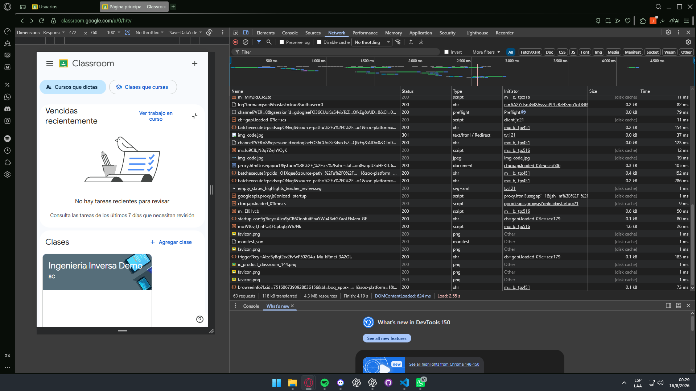<figcaption><strong>Figura 11.</strong> Network y códigos de estado. Demuestra inventario visible de recursos. Clasificación: evidencia dinámica manual.</figcaption></figure>
<figure><figcaption><strong>Figura 12 — evidencia omitida de la edición segura.</strong> `GC-DYN-03-application-storage.png` demuestra categorías de almacenamiento, pero queda en resguardo y no se incrusta mientras las cookies visibles puedan ser reutilizables. El original autorizado no fue modificado.</figcaption></figure>
<figure>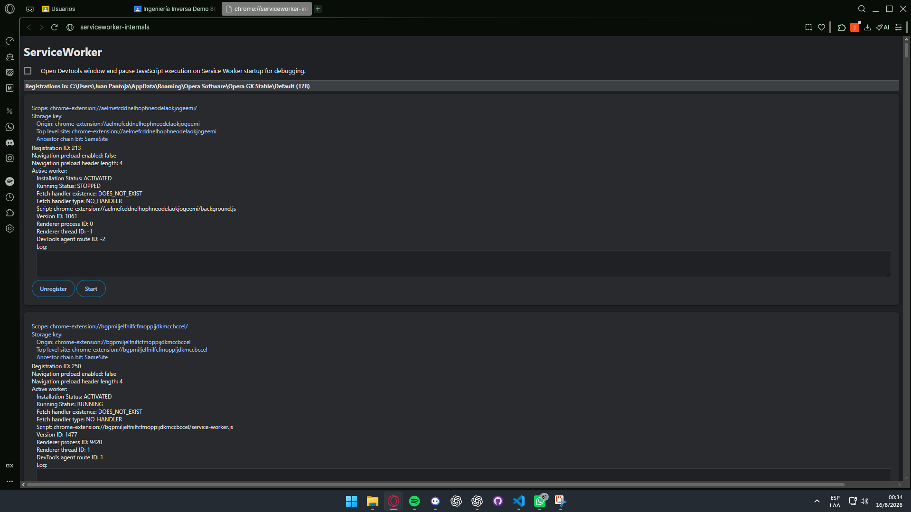<figcaption><strong>Figura 13.</strong> Service workers y cache. Demuestra componentes observables del cliente. Clasificación: evidencia dinámica manual.</figcaption></figure>
<figure><figcaption><strong>Figura 14.</strong> Performance. Demuestra una traza manual existente; no se inventan métricas. Clasificación: evidencia dinámica manual.</figcaption></figure>
<figure><figcaption><strong>Figura 15.</strong> Memory. Demuestra un heap snapshot manual existente. Clasificación: evidencia dinámica manual.</figcaption></figure>
</div>

## 19.3 EduRoom - serie principal de la réplica

<div class="figure-grid">
<figure><figcaption><strong>Figura 16.</strong> Login, 1280 x 720. Demuestra acceso en escritorio. Clasificación: réplica.</figcaption></figure>
<figure><figcaption><strong>Figura 17.</strong> Login, 768 x 1024. Demuestra adaptación a tableta y la advertencia responsive registrada. Clasificación: réplica.</figcaption></figure>
<figure><figcaption><strong>Figura 18.</strong> Login, 390 x 844. Demuestra acceso móvil. Clasificación: réplica.</figcaption></figure>
<figure><figcaption><strong>Figura 19.</strong> Dashboard, escritorio. Demuestra colección de cursos y acciones por rol. Clasificación: réplica.</figcaption></figure>
<figure>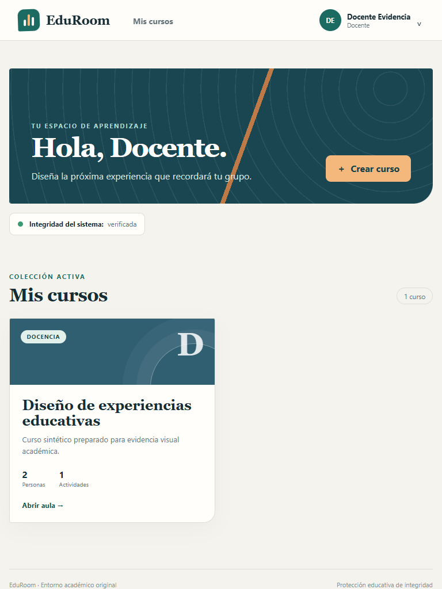<figcaption><strong>Figura 20.</strong> Dashboard, tableta. Demuestra rejilla adaptable. Clasificación: réplica.</figcaption></figure>
<figure><figcaption><strong>Figura 21.</strong> Dashboard, móvil. Demuestra navegación y cursos en ancho reducido. Clasificación: réplica.</figcaption></figure>
<figure><figcaption><strong>Figura 22.</strong> Tablón, escritorio. Demuestra contexto y publicaciones del curso. Clasificación: réplica.</figcaption></figure>
<figure>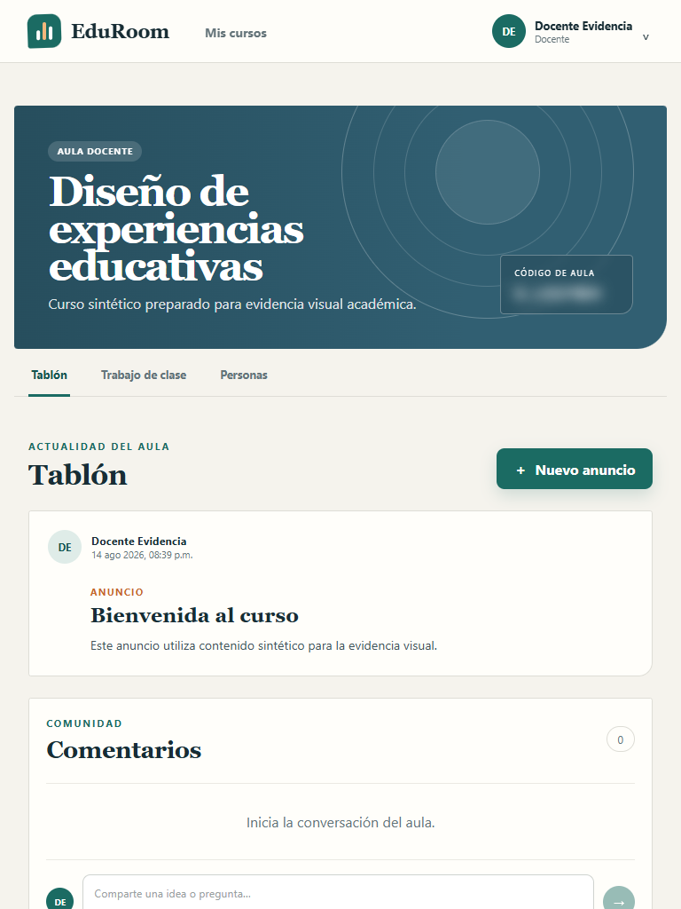<figcaption><strong>Figura 23.</strong> Tablón, tableta. Demuestra reflujo de navegación. Clasificación: réplica.</figcaption></figure>
<figure>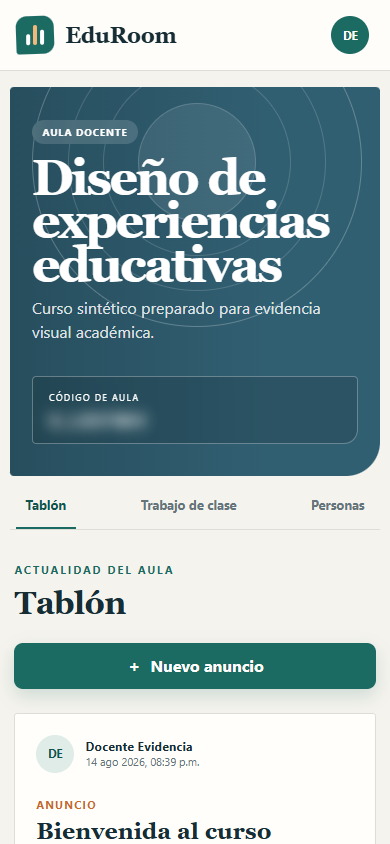<figcaption><strong>Figura 24.</strong> Tablón, móvil. Demuestra jerarquía en formato vertical. Clasificación: réplica.</figcaption></figure>
<figure><figcaption><strong>Figura 25.</strong> Trabajo de clase, escritorio. Demuestra listado y gestión de tareas. Clasificación: réplica.</figcaption></figure>
<figure>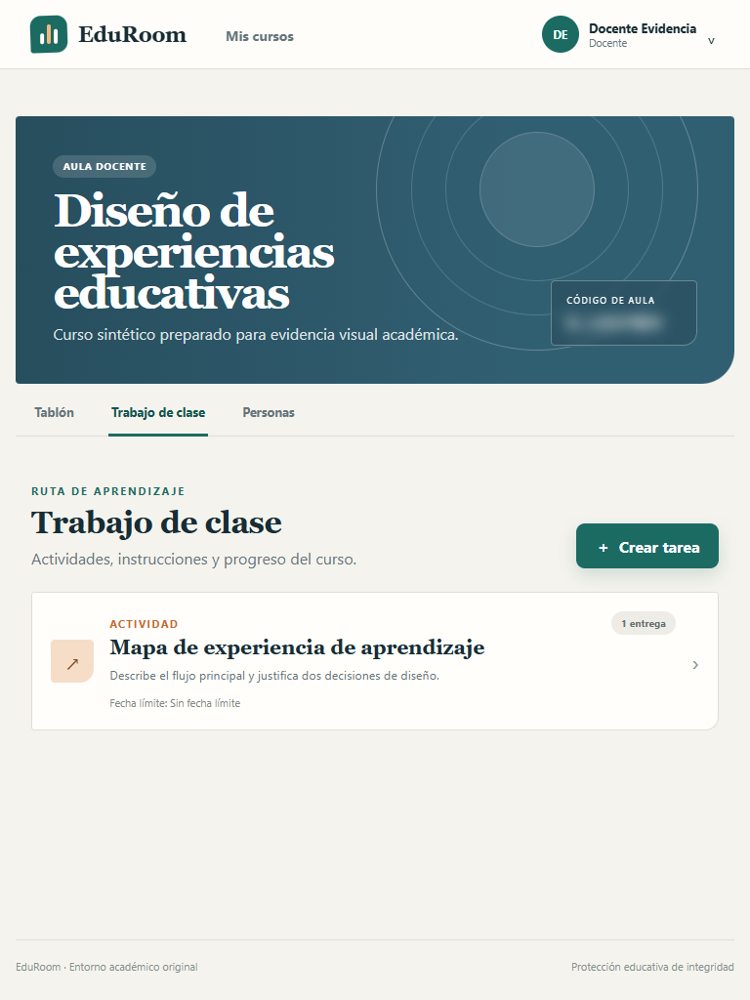<figcaption><strong>Figura 26.</strong> Trabajo de clase, tableta. Demuestra actividades legibles. Clasificación: réplica.</figcaption></figure>
<figure>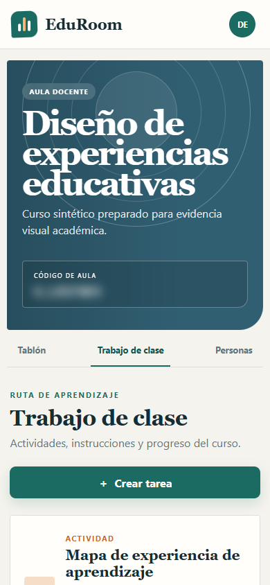<figcaption><strong>Figura 27.</strong> Trabajo de clase, móvil. Demuestra secuencia vertical. Clasificación: réplica.</figcaption></figure>
<figure><figcaption><strong>Figura 28.</strong> Personas, escritorio. Demuestra roles y miembros. Clasificación: réplica.</figcaption></figure>
<figure><figcaption><strong>Figura 29.</strong> Personas, tableta. Demuestra jerarquía de roles. Clasificación: réplica.</figcaption></figure>
<figure>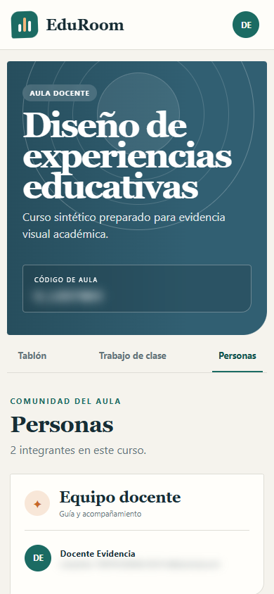<figcaption><strong>Figura 30.</strong> Personas, móvil. Demuestra miembros en formato reducido. Clasificación: réplica.</figcaption></figure>
<figure><figcaption><strong>Figura 31.</strong> Detalle de tarea, escritorio. Demuestra instrucciones, estado y comentarios. Clasificación: réplica.</figcaption></figure>
<figure><figcaption><strong>Figura 32.</strong> Detalle de tarea, tableta. Demuestra reordenamiento de paneles. Clasificación: réplica.</figcaption></figure>
<figure><figcaption><strong>Figura 33.</strong> Detalle de tarea, móvil. Demuestra estado e instrucciones accesibles. Clasificación: réplica.</figcaption></figure>
<figure><figcaption><strong>Figura 34.</strong> Entrega, escritorio. Demuestra respuesta y cambio de estado. Clasificación: réplica.</figcaption></figure>
<figure>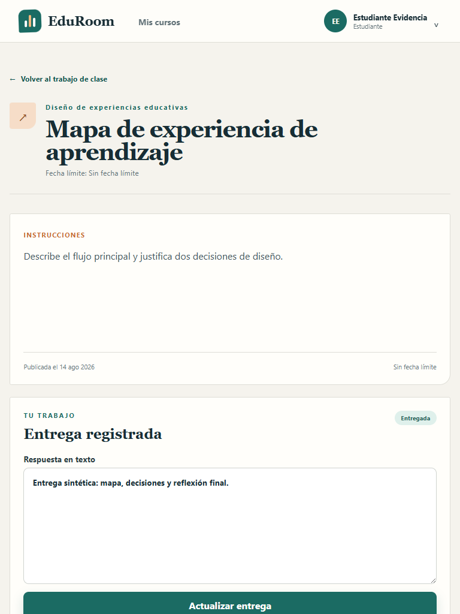<figcaption><strong>Figura 35.</strong> Entrega, tableta. Demuestra acción accesible. Clasificación: réplica.</figcaption></figure>
<figure><figcaption><strong>Figura 36.</strong> Entrega, móvil. Demuestra flujo estudiantil responsivo. Clasificación: réplica.</figcaption></figure>
<figure><figcaption><strong>Figura 37.</strong> Calificación, escritorio. Demuestra nota y retroalimentación. Clasificación: réplica.</figcaption></figure>
<figure><figcaption><strong>Figura 38.</strong> Calificación, tableta. Demuestra lectura de resultado. Clasificación: réplica.</figcaption></figure>
<figure><figcaption><strong>Figura 39.</strong> Calificación, móvil. Demuestra nota y feedback en ancho reducido. Clasificación: réplica.</figcaption></figure>
<figure><figcaption><strong>Figura 40.</strong> Integridad, escritorio. Demuestra resumen no sensible de checksum. Clasificación: prueba técnica de la réplica.</figcaption></figure>
<figure><figcaption><strong>Figura 41.</strong> Integridad, tableta. Demuestra estado responsive. Clasificación: prueba técnica de la réplica.</figcaption></figure>
<figure><figcaption><strong>Figura 42.</strong> Integridad, móvil. Demuestra estado no sensible en ancho reducido. Clasificación: prueba técnica de la réplica.</figcaption></figure>
</div>

## 19.4 EduRoom - serie complementaria

Todas las figuras 43-69 se clasifican como **réplica**. Demuestran una segunda captura de los mismos nueve flujos y tres viewports; se conservan como evidencia complementaria, no como flujos adicionales.

<div class="figure-grid">
<figure><figcaption><strong>Figura 43.</strong> Login complementario, escritorio. Demuestra acceso de la réplica.</figcaption></figure>
<figure>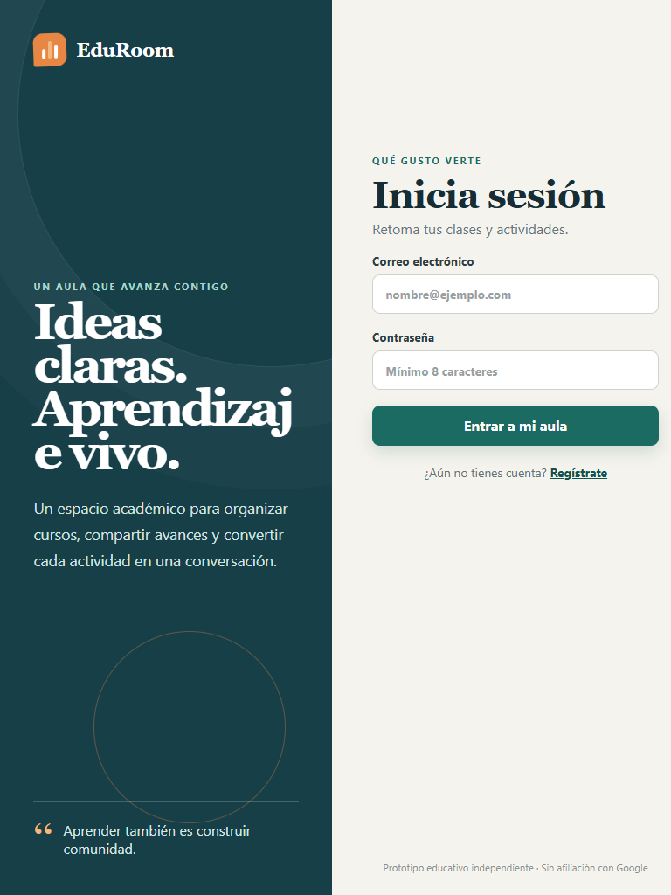<figcaption><strong>Figura 44.</strong> Login complementario, tableta. Demuestra respuesta UI de la réplica.</figcaption></figure>
<figure>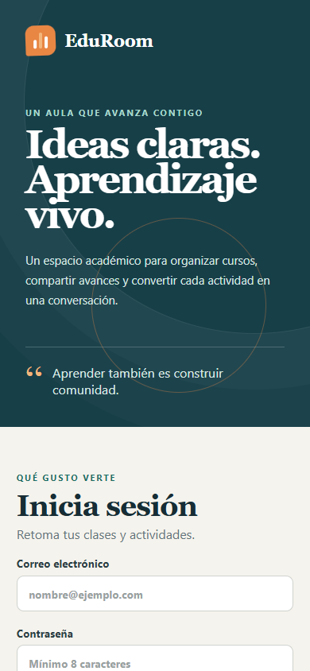<figcaption><strong>Figura 45.</strong> Login complementario, móvil. Demuestra acceso en ancho reducido.</figcaption></figure>
<figure><figcaption><strong>Figura 46.</strong> Dashboard complementario, escritorio. Demuestra cursos de EduRoom.</figcaption></figure>
<figure><figcaption><strong>Figura 47.</strong> Dashboard complementario, tableta. Demuestra distribución responsive.</figcaption></figure>
<figure><figcaption><strong>Figura 48.</strong> Dashboard complementario, móvil. Demuestra colección de cursos.</figcaption></figure>
<figure>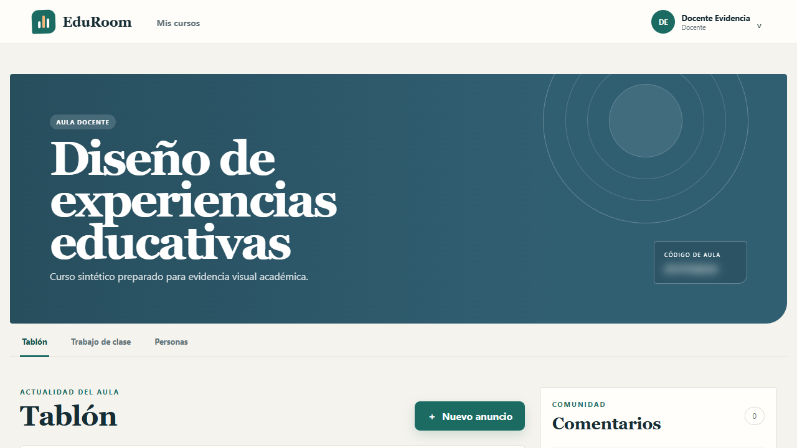<figcaption><strong>Figura 49.</strong> Tablón complementario, escritorio. Demuestra publicaciones del curso.</figcaption></figure>
<figure><figcaption><strong>Figura 50.</strong> Tablón complementario, tableta. Demuestra navegación adaptable.</figcaption></figure>
<figure><figcaption><strong>Figura 51.</strong> Tablón complementario, móvil. Demuestra contexto del curso.</figcaption></figure>
<figure>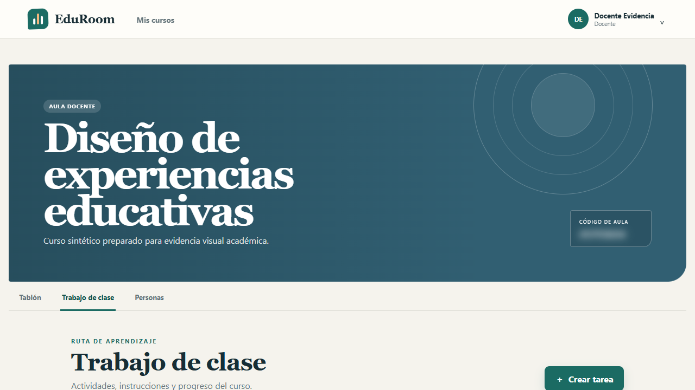<figcaption><strong>Figura 52.</strong> Trabajo complementario, escritorio. Demuestra actividades de EduRoom.</figcaption></figure>
<figure><figcaption><strong>Figura 53.</strong> Trabajo complementario, tableta. Demuestra legibilidad responsive.</figcaption></figure>
<figure><figcaption><strong>Figura 54.</strong> Trabajo complementario, móvil. Demuestra tareas en formato vertical.</figcaption></figure>
<figure>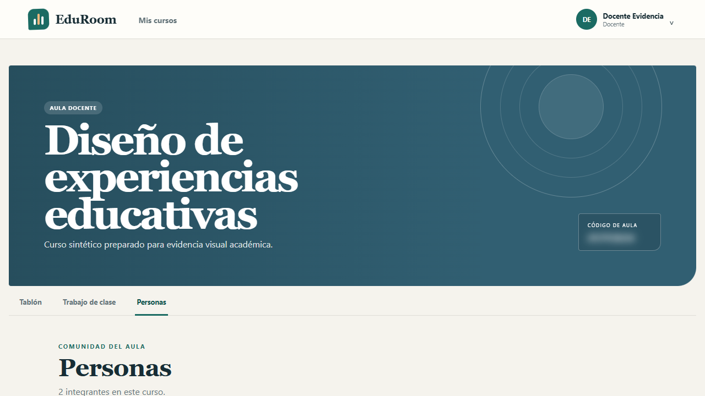<figcaption><strong>Figura 55.</strong> Personas complementaria, escritorio. Demuestra roles y miembros.</figcaption></figure>
<figure>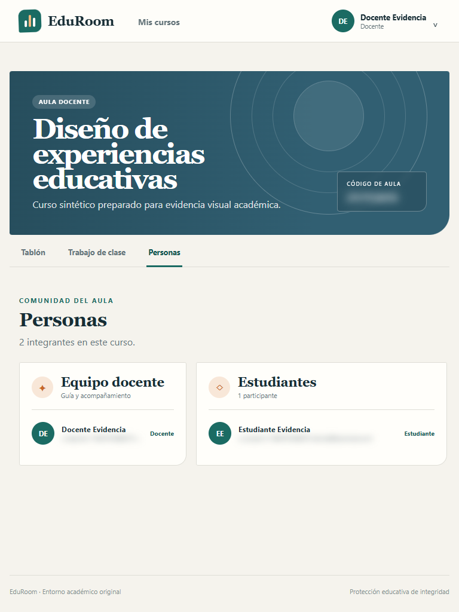<figcaption><strong>Figura 56.</strong> Personas complementaria, tableta. Demuestra jerarquía adaptable.</figcaption></figure>
<figure>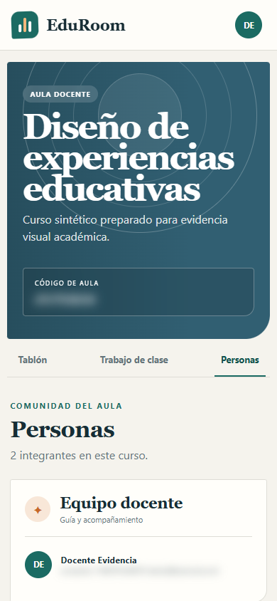<figcaption><strong>Figura 57.</strong> Personas complementaria, móvil. Demuestra agrupación por roles.</figcaption></figure>
<figure>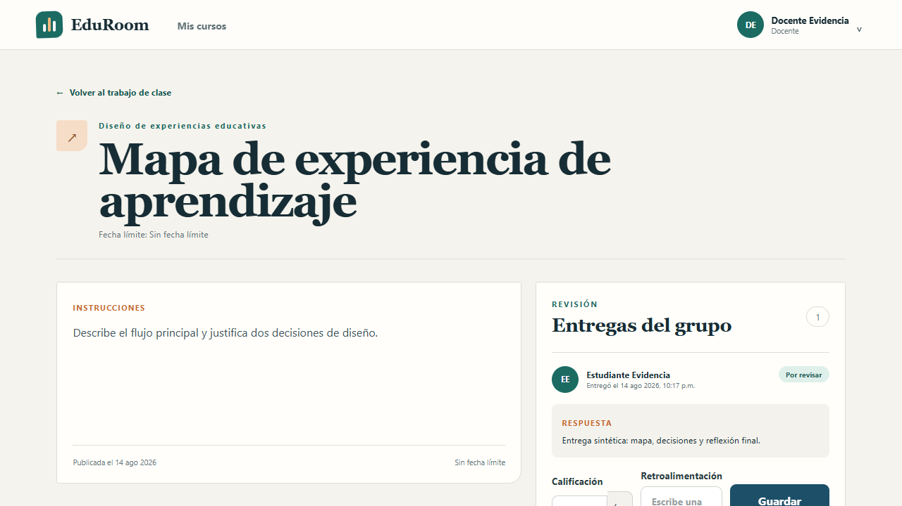<figcaption><strong>Figura 58.</strong> Detalle complementario, escritorio. Demuestra información de tarea.</figcaption></figure>
<figure>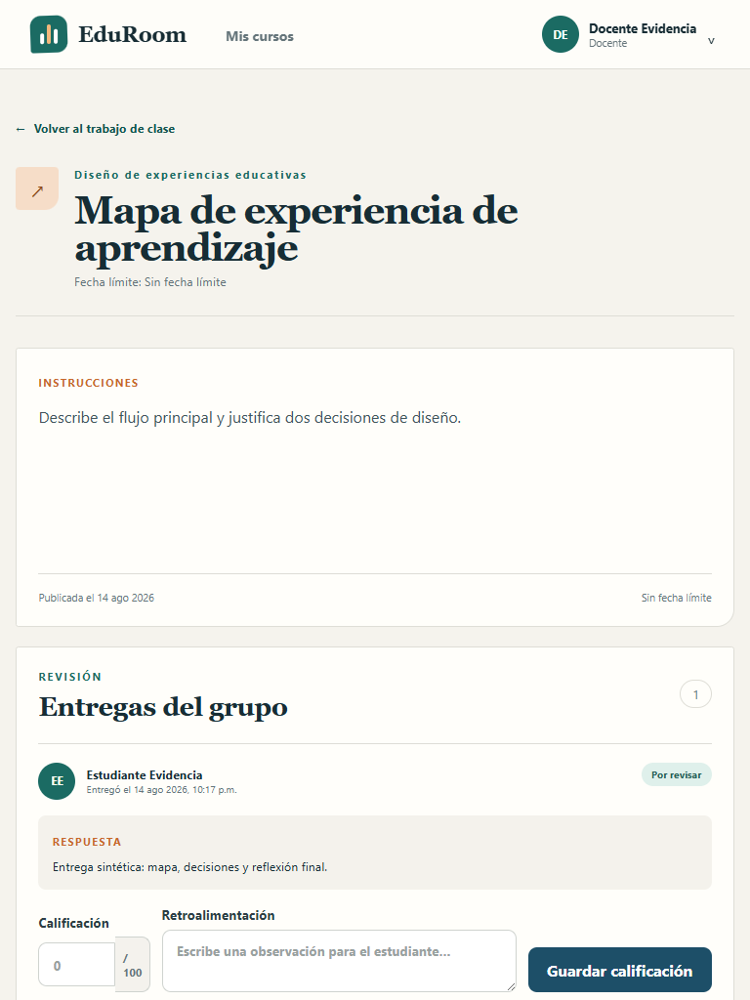<figcaption><strong>Figura 59.</strong> Detalle complementario, tableta. Demuestra paneles adaptables.</figcaption></figure>
<figure>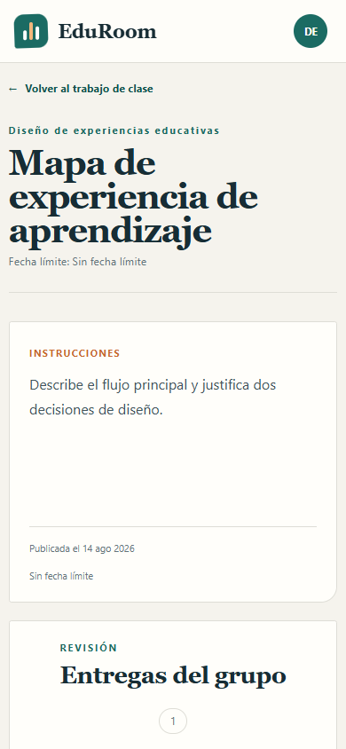<figcaption><strong>Figura 60.</strong> Detalle complementario, móvil. Demuestra instrucciones y estado.</figcaption></figure>
<figure><figcaption><strong>Figura 61.</strong> Entrega complementaria, escritorio. Demuestra envío estudiantil.</figcaption></figure>
<figure><figcaption><strong>Figura 62.</strong> Entrega complementaria, tableta. Demuestra acción y respuesta.</figcaption></figure>
<figure>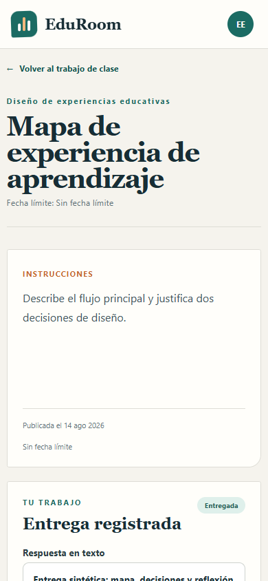<figcaption><strong>Figura 63.</strong> Entrega complementaria, móvil. Demuestra flujo en ancho reducido.</figcaption></figure>
<figure>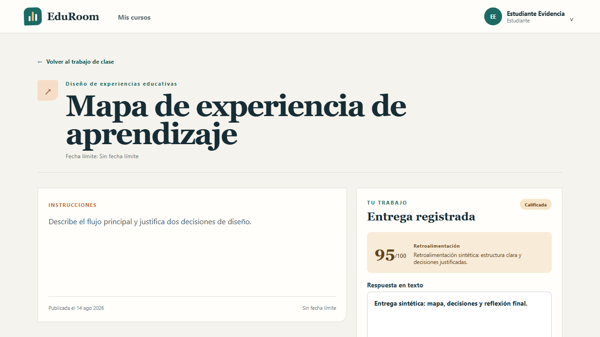<figcaption><strong>Figura 64.</strong> Calificación complementaria, escritorio. Demuestra evaluación y feedback.</figcaption></figure>
<figure>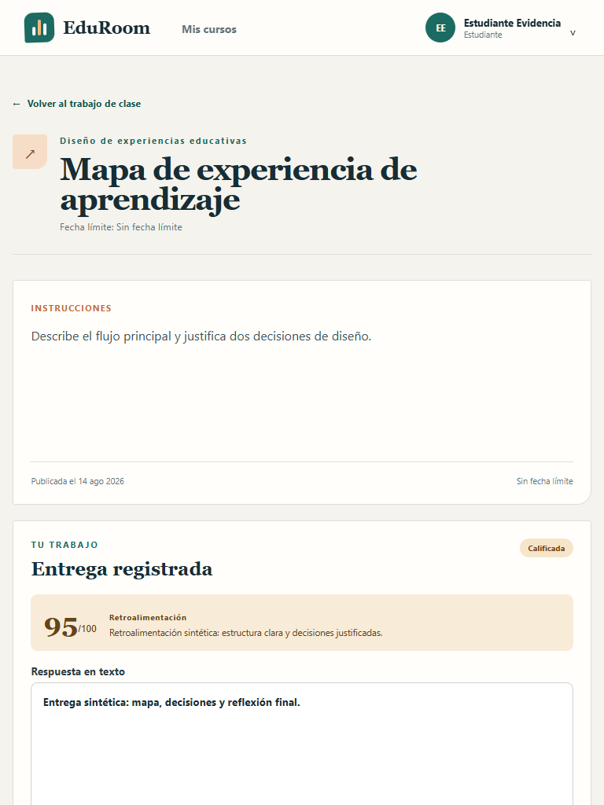<figcaption><strong>Figura 65.</strong> Calificación complementaria, tableta. Demuestra resultado responsive.</figcaption></figure>
<figure>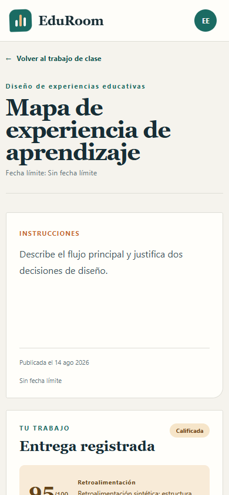<figcaption><strong>Figura 66.</strong> Calificación complementaria, móvil. Demuestra nota y retroalimentación.</figcaption></figure>
<figure><figcaption><strong>Figura 67.</strong> Integridad complementaria, escritorio. Demuestra estado público no sensible.</figcaption></figure>
<figure><figcaption><strong>Figura 68.</strong> Integridad complementaria, tableta. Demuestra respuesta adaptable.</figcaption></figure>
<figure>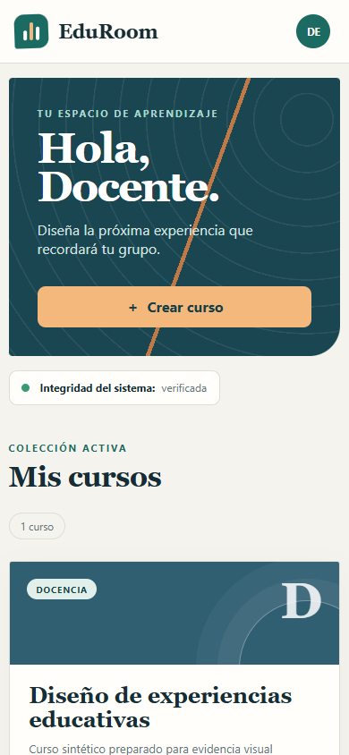<figcaption><strong>Figura 69.</strong> Integridad complementaria, móvil. Demuestra estado en ancho reducido.</figcaption></figure>
</div>

## 19.5 Categorías técnicas sin imagen disponible

No se insertan figuras de `evidence/api/`, `evidence/render/`, `evidence/database/` o `evidence/github/` porque no existe actualmente ningún PNG en esas carpetas. `evidence/security/` contiene la prueba textual `SEC-07-obfuscated-build-proof.txt`, pero no una imagen. Estas ausencias permanecen como **[PENDIENTE DE CAPTURA MANUAL]** y no afectan la validez de las capturas manuales autorizadas o del comparativo por resolución.

---

**Declaración final:** no se vulneró Google Classroom, no se automatizó su análisis, no se copiaron activos propietarios, no se afirma equivalencia pixel a pixel y no se promete seguridad absoluta. EduRoom y sus evidencias se presentan exclusivamente con fines académicos.
